# Métricas - Primer pilar de la observabilidad

La observabilidad moderna se apoya en tres pilares fundamentales: `métricas`, `logs` y `traces`. En esta sección nos
enfocaremos en el primero: las `métricas`. Estas nos permiten `cuantificar` el comportamiento de nuestra aplicación en
tiempo real, facilitando el monitoreo, la detección de anomalías y la toma de decisiones basada en datos.
---

# Fase 1 – Métricas Automáticas (sin modificar el código Java)

En esta fase inicial activaremos métricas automáticas sin necesidad de modificar el código fuente de nuestra aplicación.
Basta con agregar las dependencias necesarias y realizar una configuración mínima para comenzar a visualizar métricas
expuestas por `Spring Boot Actuator`.

Esto nos permitirá entender el flujo de instrumentación sin complejidad adicional, y observar cómo `Spring Boot` ya
incluye sensores listos para usar.

## Dependencias necesarias

Agrega las siguientes dependencias en el archivo `pom.xml` del proyecto `spring-observability`. Podemos generarlas
directamente desde
[Spring Initializr](https://start.spring.io/#!type=maven-project&language=java&platformVersion=3.5.5&packaging=jar&jvmVersion=21&groupId=dev.magadiflo&artifactId=spring-observability&name=spring-observability&description=Demo%20project%20for%20Spring%20Boot&packageName=dev.magadiflo.observability.app&dependencies=web,lombok,actuator,prometheus).

````xml

<dependencies>
    <!--Spring Boot Actuator: expone métricas y health checks-->
    <dependency>
        <groupId>org.springframework.boot</groupId>
        <artifactId>spring-boot-starter-actuator</artifactId>
    </dependency>
    <!--Micrometer Prometheus: exporta métricas en formato Prometheus-->
    <dependency>
        <groupId>io.micrometer</groupId>
        <artifactId>micrometer-registry-prometheus</artifactId>
        <scope>runtime</scope>
    </dependency>
</dependencies>
````

- `spring-boot-starter-actuator`
    - Activa endpoints de observabilidad como `/actuator/health`, `/actuator/metrics`.
    - Recolecta automáticamente métricas de:
        - Peticiones HTTP (tiempo de respuesta, conteo por código de estado)
        - JVM (uso de memoria, GC, hilos)
        - Sistema operativo (CPU, disco, etc.)
    - Es como instalar sensores invisibles en tu aplicación: no necesitas escribir código adicional.
    - El endpoint `/actuator/health` es vital para sistemas como `Kubernetes`, que lo usan para verificar si la
      aplicación está viva y lista para recibir tráfico.


- `micrometer-registry-prometheus`
    - `Micrometer` es la biblioteca de instrumentación que `Spring Boot` usa por defecto.
    - Esta dependencia convierte las métricas internas de `Micrometer` al formato de texto plano que `Prometheus` puede
      leer.
    - Habilita el endpoint `/actuator/prometheus`, que expone todas las métricas en formato compatible con `Prometheus`.
    - Actúa como un “traductor” entre tu aplicación y el sistema de monitoreo.

## Endpoints de Actuator por defecto

Una vez agregadas las dependencias necesarias y ejecutada la aplicación, `Spring Boot Actuator` habilita
automáticamente una serie de endpoints que permiten observar el estado interno de la aplicación sin necesidad
de escribir código adicional.

Al acceder al endpoint raíz `/actuator`, podemos ver los enlaces disponibles que `Actuator expone por defecto`:

````bash
$ curl -v http://localhost:8080/actuator | jq
>
< HTTP/1.1 200
< Content-Type: application/vnd.spring-boot.actuator.v3+json
< Transfer-Encoding: chunked
< Date: Thu, 04 Sep 2025 21:16:12 GMT
<
{
  "_links": {
    "self": {
      "href": "http://localhost:8080/actuator",
      "templated": false
    },
    "health": {
      "href": "http://localhost:8080/actuator/health",
      "templated": false
    },
    "health-path": {
      "href": "http://localhost:8080/actuator/health/{*path}",
      "templated": true
    }
  }
}
````

| Endpoint                   | Descripción                                                                                       |
|----------------------------|---------------------------------------------------------------------------------------------------|
| `/actuator`                | Muestra todos los endpoints disponibles en la aplicación.                                         |
| `/actuator/health`         | Indica el estado de salud general de la aplicación.                                               |
| `/actuator/health/{*path}` | Permite consultar el estado de componentes específicos (por ejemplo, base de datos, disco, etc.). |

## Verificando el estado de salud

Uno de los endpoints más importantes es `/actuator/health`, que responde con el estado actual de la aplicación. Este
endpoint es utilizado por sistemas de orquestación como `Kubernetes` para determinar si la aplicación está viva
`(liveness)` y lista para recibir tráfico `(readiness)`.

Ejemplo de consulta:

````bash
$ curl -v http://localhost:8080/actuator/health | jq
>
< HTTP/1.1 200
< Content-Type: application/vnd.spring-boot.actuator.v3+json
< Transfer-Encoding: chunked
< Date: Thu, 04 Sep 2025 21:16:36 GMT
<
{
  "status": "UP"
}
````

El valor `UP` indica que la aplicación está funcionando correctamente. Si algún componente crítico falla
(como la base de datos), este estado puede cambiar a `DOWN` o `OUT_OF_SERVICE`.

## Configuración de Actuator para exponer métricas

Por defecto, `Spring Boot Actuator` no expone todos sus endpoints vía HTTP por razones de seguridad. Para habilitar
los endpoints necesarios para observabilidad, debemos configurar explícitamente cuáles queremos exponer en el archivo
`application.yml`.

En nuestro proyecto `spring-observability`, agregamos la siguiente configuración:

````yml
management:
  endpoints:
    web:
      exposure:
        include: health, metrics, prometheus
````

- `management.endpoints.web.exposure.include`: por defecto, `Actuator` no expone casi nada vía HTTP. Aquí habilitamos:
    - `health` → `/actuator/health` - Estado de la aplicación `(UP/DOWN)` en formato `JSON`.
    - `metrics` → `/actuator/metrics` - Métricas en formato `JSON` (para debugging).
    - `prometheus` → `/actuator/prometheus` - Métricas en formato `Prometheus`.

🧠 Detalles técnicos

- `management.endpoints.web.exposure.include`
    - Esta propiedad define qué endpoints estarán disponibles vía HTTP.
    - `Spring Boot Actuator` incluye muchos endpoints (como `env`, `beans`, `loggers`, etc.), pero por seguridad, solo
      se exponen los que tú definas aquí.
- El endpoint `/actuator/prometheus` es clave para que `Prometheus` pueda recolectar métricas.
    - Este endpoint expone las métricas en el formato que `Prometheus` espera, como:
      ````bash
      http_server_requests_seconds_count{method="GET",uri="/api/products",status="200",...} 42.0
      ````
- El endpoint `/actuator/metrics` permite explorar las métricas disponibles, ver sus tags y valores actuales.
    - Es útil para entender cómo se nombran y agrupan las métricas antes de visualizarlas en `Grafana`.

## Verificación de métricas expuestas por Actuator

Una vez configurado `Spring Boot Actuator` y habilitados los endpoints necesarios, podemos verificar que las métricas
estén siendo correctamente expuestas. Para ello, iniciamos la aplicación y accedemos a los siguientes endpoints:

### 1. Estado de salud de la aplicación

El endpoint `/actuator/health` nos permite verificar si la aplicación está funcionando correctamente. Este estado es
utilizado por sistemas de orquestación como `Kubernetes` para determinar si la instancia está viva `(liveness)` y
lista para recibir tráfico `(readiness)`.

````bash
$ curl -v http://localhost:8080/actuator/health | jq
>
< HTTP/1.1 200
< Content-Type: application/vnd.spring-boot.actuator.v3+json
< Transfer-Encoding: chunked
< Date: Thu, 04 Sep 2025 22:13:37 GMT
<
{
  "status": "UP"
}
````

Un estado `UP` indica que todos los componentes críticos están operativos. Si algún componente falla (por ejemplo, la
base de datos), el estado puede cambiar a `DOWN` o `OUT_OF_SERVICE`.

### 2. Listado de métricas disponibles

El endpoint `/actuator/metrics` expone todas las métricas recolectadas por `Micrometer` en formato JSON. Este listado
incluye métricas del sistema, de la JVM, del servidor HTTP, del pool de hilos, entre otras.

````bash
$ curl -v http://localhost:8080/actuator/metrics | jq
>
< HTTP/1.1 200
< Content-Type: application/vnd.spring-boot.actuator.v3+json
< Transfer-Encoding: chunked
< Date: Thu, 04 Sep 2025 22:14:31 GMT
<
{
  "names": [
    "application.ready.time",
    "application.started.time",
    "disk.free",
    "disk.total",
    "executor.active",
    "executor.completed",
    "executor.pool.core",
    "executor.pool.max",
    "executor.pool.size",
    "executor.queue.remaining",
    "executor.queued",
    "http.server.requests",
    "http.server.requests.active",
    "jvm.buffer.count",
    "jvm.buffer.memory.used",
    "jvm.buffer.total.capacity",
    "jvm.classes.loaded",
    "jvm.classes.unloaded",
    "jvm.compilation.time",
    "jvm.gc.live.data.size",
    "jvm.gc.max.data.size",
    "jvm.gc.memory.allocated",
    "jvm.gc.memory.promoted",
    "jvm.gc.overhead",
    "jvm.gc.pause",
    "jvm.info",
    "jvm.memory.committed",
    "jvm.memory.max",
    "jvm.memory.usage.after.gc",
    "jvm.memory.used",
    "jvm.threads.daemon",
    "jvm.threads.live",
    "jvm.threads.peak",
    "jvm.threads.started",
    "jvm.threads.states",
    "logback.events",
    "process.cpu.time",
    "process.cpu.usage",
    "process.start.time",
    "process.uptime",
    "system.cpu.count",
    "system.cpu.usage",
    "tomcat.sessions.active.current",
    "tomcat.sessions.active.max",
    "tomcat.sessions.alive.max",
    "tomcat.sessions.created",
    "tomcat.sessions.expired",
    "tomcat.sessions.rejected"
  ]
}
````

`¿Cómo interpretar estas métricas?`. Cada nombre representa una métrica que puede ser consultada individualmente. Por
ejemplo:

- `http.server.requests`: mide el número de peticiones HTTP, su duración y estado.
- `jvm.memory.used`: indica la memoria usada por la JVM.
- `system.cpu.usage`: muestra el uso de CPU del sistema.

Para consultar una métrica específica y ver sus valores actuales y etiquetas `(tags)`, puedes hacer:

````bash
$ curl -v http://localhost:8080/actuator/metrics/http.server.requests | jq
>
< HTTP/1.1 200
< Content-Disposition: inline;filename=f.txt
< Content-Type: application/vnd.spring-boot.actuator.v3+json
< Transfer-Encoding: chunked
< Date: Thu, 04 Sep 2025 22:32:48 GMT
<
{
  "name": "http.server.requests",
  "baseUnit": "seconds",
  "measurements": [
    {
      "statistic": "COUNT",
      "value": 6.0
    },
    {
      "statistic": "TOTAL_TIME",
      "value": 1.2487523
    },
    {
      "statistic": "MAX",
      "value": 0.0025255
    }
  ],
  "availableTags": [
    {
      "tag": "exception",
      "values": [
        "none"
      ]
    },
    {
      "tag": "method",
      "values": [
        "GET"
      ]
    },
    {
      "tag": "error",
      "values": [
        "none"
      ]
    },
    {
      "tag": "uri",
      "values": [
        "/actuator/metrics/{requiredMetricName}",
        "/actuator/health",
        "/actuator/metrics",
        "/actuator/prometheus"
      ]
    },
    {
      "tag": "outcome",
      "values": [
        "SUCCESS"
      ]
    },
    {
      "tag": "status",
      "values": [
        "200"
      ]
    }
  ]
}
````

#### Diferencias entre `/actuator/metrics` y `/actuator/prometheus`

📘 `/actuator/metrics`

- Muestra un listado de nombres de métricas disponibles.
- Permite consultar métricas específicas con sus tags y valores actuales.
- Ideal para debugging, exploración rápida o entender cómo se estructuran las métricas.
- Ejemplo:

````bash
$ curl http://localhost:8080/actuator/metrics/http.server.requests | jq
````

- Esto te muestra los valores agrupados por method, status, uri, etc.

📘 `/actuator/prometheus`

- Expone `todas las métricas` en formato compatible con `Prometheus`.
- Incluye `HELP` y `TYPE`, valores y etiquetas.
- Es consumido automáticamente por `Prometheus` mediante scraping.
- No está pensado para exploración manual, aunque puedes verlo con curl.

🧠 ¿Entonces para qué sirve `/actuator/metrics`?

- Para `explorar` qué métricas están disponibles.
- Para `probar` que una métrica personalizada está funcionando.
- Para `verificar` los tags y valores antes de configurar dashboards o alertas.

En resumen:

- `/actuator/metrics` es tu visor técnico como desarrollador.
- `/actuator/prometheus` es tu fuente de datos cruda para monitoreo automatizado.

Ambos son complementarios, y entenderlos te da control total sobre cómo instrumentas y visualizas tu aplicación.

### 3. La “materia prima” para Prometheus

Este endpoint devuelve todas las métricas recolectadas por `Micrometer` en formato de `texto plano` compatible con el
`Prometheus exposition format`, que es el estándar que `Prometheus` utiliza para hacer `scraping`.

Este endpoint es el punto de entrada para que `Prometheus` pueda recolectar métricas de tu aplicación. Más adelante
configuraremos `Prometheus` para que haga `scraping` de este endpoint cada cierto intervalo, y luego visualizaremos
los datos en `Grafana`.

````bash
$ curl -v http://localhost:8080/actuator/prometheus
>
< HTTP/1.1 200
< Content-Type: text/plain;version=0.0.4;charset=utf-8
< Content-Length: 13102
< Date: Thu, 04 Sep 2025 22:15:53 GMT
<
# HELP application_ready_time_seconds Time taken for the application to be ready to service requests
# TYPE application_ready_time_seconds gauge
application_ready_time_seconds{main_application_class="dev.magadiflo.observability.app.SpringObservabilityApplication"} 4.317
# HELP application_started_time_seconds Time taken to start the application
# TYPE application_started_time_seconds gauge
application_started_time_seconds{main_application_class="dev.magadiflo.observability.app.SpringObservabilityApplication"} 4.187
# HELP disk_free_bytes Usable space for path
# TYPE disk_free_bytes gauge
disk_free_bytes{path="D:\\programming\\spring\\15.martin_diaz\\spring-observability\\."} 3.84774115328E11
# HELP disk_total_bytes Total space for path
# TYPE disk_total_bytes gauge
disk_total_bytes{path="D:\\programming\\spring\\15.martin_diaz\\spring-observability\\."} 4.23202123776E11
# HELP executor_active_threads The approximate number of threads that are actively executing tasks
# TYPE executor_active_threads gauge
executor_active_threads{name="applicationTaskExecutor"} 0.0
# HELP executor_completed_tasks_total The approximate total number of tasks that have completed execution
# TYPE executor_completed_tasks_total counter
executor_completed_tasks_total{name="applicationTaskExecutor"} 0.0
# HELP executor_pool_core_threads The core number of threads for the pool
# TYPE executor_pool_core_threads gauge
executor_pool_core_threads{name="applicationTaskExecutor"} 8.0
# HELP executor_pool_max_threads The maximum allowed number of threads in the pool
# TYPE executor_pool_max_threads gauge
executor_pool_max_threads{name="applicationTaskExecutor"} 2.147483647E9
# HELP executor_pool_size_threads The current number of threads in the pool
# TYPE executor_pool_size_threads gauge
executor_pool_size_threads{name="applicationTaskExecutor"} 0.0
# HELP executor_queue_remaining_tasks The number of additional elements that this queue can ideally accept without blocking
# TYPE executor_queue_remaining_tasks gauge
executor_queue_remaining_tasks{name="applicationTaskExecutor"} 2.147483647E9
# HELP executor_queued_tasks The approximate number of tasks that are queued for execution
# TYPE executor_queued_tasks gauge
executor_queued_tasks{name="applicationTaskExecutor"} 0.0
# HELP http_server_requests_active_seconds
# TYPE http_server_requests_active_seconds summary
http_server_requests_active_seconds_count{exception="none",method="GET",outcome="SUCCESS",status="200",uri="UNKNOWN"} 1
http_server_requests_active_seconds_sum{exception="none",method="GET",outcome="SUCCESS",status="200",uri="UNKNOWN"} 0.0251604
# HELP http_server_requests_active_seconds_max
# TYPE http_server_requests_active_seconds_max gauge
http_server_requests_active_seconds_max{exception="none",method="GET",outcome="SUCCESS",status="200",uri="UNKNOWN"} 0.0251674
# HELP http_server_requests_seconds
# TYPE http_server_requests_seconds summary
http_server_requests_seconds_count{error="none",exception="none",method="GET",outcome="SUCCESS",status="200",uri="/actuator/health"} 1
http_server_requests_seconds_sum{error="none",exception="none",method="GET",outcome="SUCCESS",status="200",uri="/actuator/health"} 0.1386555
http_server_requests_seconds_count{error="none",exception="none",method="GET",outcome="SUCCESS",status="200",uri="/actuator/metrics"} 1
http_server_requests_seconds_sum{error="none",exception="none",method="GET",outcome="SUCCESS",status="200",uri="/actuator/metrics"} 0.0050656
http_server_requests_seconds_count{error="none",exception="none",method="GET",outcome="SUCCESS",status="200",uri="/actuator/prometheus"} 1
http_server_requests_seconds_sum{error="none",exception="none",method="GET",outcome="SUCCESS",status="200",uri="/actuator/prometheus"} 1.0239655
# HELP http_server_requests_seconds_max
# TYPE http_server_requests_seconds_max gauge
http_server_requests_seconds_max{error="none",exception="none",method="GET",outcome="SUCCESS",status="200",uri="/actuator/health"} 0.1386555
http_server_requests_seconds_max{error="none",exception="none",method="GET",outcome="SUCCESS",status="200",uri="/actuator/metrics"} 0.0050656
http_server_requests_seconds_max{error="none",exception="none",method="GET",outcome="SUCCESS",status="200",uri="/actuator/prometheus"} 1.0239655
# HELP jvm_info JVM version info
# TYPE jvm_info gauge
jvm_info{runtime="Java(TM) SE Runtime Environment",vendor="Oracle Corporation",version="21.0.6+8-LTS-188"} 1
# HELP jvm_buffer_count_buffers An estimate of the number of buffers in the pool
# TYPE jvm_buffer_count_buffers gauge
jvm_buffer_count_buffers{id="direct"} 7.0
jvm_buffer_count_buffers{id="mapped"} 0.0
jvm_buffer_count_buffers{id="mapped - 'non-volatile memory'"} 0.0
# HELP jvm_buffer_memory_used_bytes An estimate of the memory that the Java virtual machine is using for this buffer pool
# TYPE jvm_buffer_memory_used_bytes gauge
jvm_buffer_memory_used_bytes{id="direct"} 57344.0
jvm_buffer_memory_used_bytes{id="mapped"} 0.0
jvm_buffer_memory_used_bytes{id="mapped - 'non-volatile memory'"} 0.0
# HELP jvm_buffer_total_capacity_bytes An estimate of the total capacity of the buffers in this pool
# TYPE jvm_buffer_total_capacity_bytes gauge
jvm_buffer_total_capacity_bytes{id="direct"} 57344.0
jvm_buffer_total_capacity_bytes{id="mapped"} 0.0
jvm_buffer_total_capacity_bytes{id="mapped - 'non-volatile memory'"} 0.0
# HELP jvm_classes_loaded_classes The number of classes that are currently loaded in the Java virtual machine
# TYPE jvm_classes_loaded_classes gauge
jvm_classes_loaded_classes 8738.0
# HELP jvm_classes_unloaded_classes_total The number of classes unloaded in the Java virtual machine
# TYPE jvm_classes_unloaded_classes_total counter
jvm_classes_unloaded_classes_total 0.0
# HELP jvm_compilation_time_ms_total The approximate accumulated elapsed time spent in compilation
# TYPE jvm_compilation_time_ms_total counter
jvm_compilation_time_ms_total{compiler="HotSpot 64-Bit Tiered Compilers"} 11261.0
# HELP jvm_gc_live_data_size_bytes Size of long-lived heap memory pool after reclamation
# TYPE jvm_gc_live_data_size_bytes gauge
jvm_gc_live_data_size_bytes 0.0
# HELP jvm_gc_max_data_size_bytes Max size of long-lived heap memory pool
# TYPE jvm_gc_max_data_size_bytes gauge
jvm_gc_max_data_size_bytes 8.573157376E9
# HELP jvm_gc_memory_allocated_bytes_total Incremented for an increase in the size of the (young) heap memory pool after one GC to before the next
# TYPE jvm_gc_memory_allocated_bytes_total counter
jvm_gc_memory_allocated_bytes_total 2.9360128E7
# HELP jvm_gc_memory_promoted_bytes_total Count of positive increases in the size of the old generation memory pool before GC to after GC
# TYPE jvm_gc_memory_promoted_bytes_total counter
jvm_gc_memory_promoted_bytes_total 2669248.0
# HELP jvm_gc_overhead An approximation of the percent of CPU time used by GC activities over the last lookback period or since monitoring began, whichever is shorter, in the range [0..1]
# TYPE jvm_gc_overhead gauge
jvm_gc_overhead 3.916623577877977E-5
# HELP jvm_gc_pause_seconds Time spent in GC pause
# TYPE jvm_gc_pause_seconds summary
jvm_gc_pause_seconds_count{action="end of minor GC",cause="G1 Evacuation Pause",gc="G1 Young Generation"} 1
jvm_gc_pause_seconds_sum{action="end of minor GC",cause="G1 Evacuation Pause",gc="G1 Young Generation"} 0.006
# HELP jvm_gc_pause_seconds_max Time spent in GC pause
# TYPE jvm_gc_pause_seconds_max gauge
jvm_gc_pause_seconds_max{action="end of minor GC",cause="G1 Evacuation Pause",gc="G1 Young Generation"} 0.006
# HELP jvm_memory_committed_bytes The amount of memory in bytes that is committed for the Java virtual machine to use
# TYPE jvm_memory_committed_bytes gauge
jvm_memory_committed_bytes{area="heap",id="G1 Eden Space"} 3.3554432E7
jvm_memory_committed_bytes{area="heap",id="G1 Old Gen"} 2.5165824E7
jvm_memory_committed_bytes{area="heap",id="G1 Survivor Space"} 8388608.0
jvm_memory_committed_bytes{area="nonheap",id="CodeHeap 'non-nmethods'"} 2555904.0
jvm_memory_committed_bytes{area="nonheap",id="CodeHeap 'non-profiled nmethods'"} 4325376.0
jvm_memory_committed_bytes{area="nonheap",id="CodeHeap 'profiled nmethods'"} 1.2320768E7
jvm_memory_committed_bytes{area="nonheap",id="Compressed Class Space"} 5701632.0
jvm_memory_committed_bytes{area="nonheap",id="Metaspace"} 4.4498944E7
# HELP jvm_memory_max_bytes The maximum amount of memory in bytes that can be used for memory management
# TYPE jvm_memory_max_bytes gauge
jvm_memory_max_bytes{area="heap",id="G1 Eden Space"} -1.0
jvm_memory_max_bytes{area="heap",id="G1 Old Gen"} 8.573157376E9
jvm_memory_max_bytes{area="heap",id="G1 Survivor Space"} -1.0
jvm_memory_max_bytes{area="nonheap",id="CodeHeap 'non-nmethods'"} 5898240.0
jvm_memory_max_bytes{area="nonheap",id="CodeHeap 'non-profiled nmethods'"} 1.2288E8
jvm_memory_max_bytes{area="nonheap",id="CodeHeap 'profiled nmethods'"} 1.2288E8
jvm_memory_max_bytes{area="nonheap",id="Compressed Class Space"} 1.073741824E9
jvm_memory_max_bytes{area="nonheap",id="Metaspace"} -1.0
# HELP jvm_memory_usage_after_gc The percentage of long-lived heap pool used after the last GC event, in the range [0..1]
# TYPE jvm_memory_usage_after_gc gauge
jvm_memory_usage_after_gc{area="heap",pool="long-lived"} 0.0016932440830536785
# HELP jvm_memory_used_bytes The amount of used memory
# TYPE jvm_memory_used_bytes gauge
jvm_memory_used_bytes{area="heap",id="G1 Eden Space"} 0.0
jvm_memory_used_bytes{area="heap",id="G1 Old Gen"} 1.4516448E7
jvm_memory_used_bytes{area="heap",id="G1 Survivor Space"} 5407936.0
jvm_memory_used_bytes{area="nonheap",id="CodeHeap 'non-nmethods'"} 1659776.0
jvm_memory_used_bytes{area="nonheap",id="CodeHeap 'non-profiled nmethods'"} 4310784.0
jvm_memory_used_bytes{area="nonheap",id="CodeHeap 'profiled nmethods'"} 1.22688E7
jvm_memory_used_bytes{area="nonheap",id="Compressed Class Space"} 5355512.0
jvm_memory_used_bytes{area="nonheap",id="Metaspace"} 4.3795784E7
# HELP jvm_threads_daemon_threads The current number of live daemon threads
# TYPE jvm_threads_daemon_threads gauge
jvm_threads_daemon_threads 19.0
# HELP jvm_threads_live_threads The current number of live threads including both daemon and non-daemon threads
# TYPE jvm_threads_live_threads gauge
jvm_threads_live_threads 23.0
# HELP jvm_threads_peak_threads The peak live thread count since the Java virtual machine started or peak was reset
# TYPE jvm_threads_peak_threads gauge
jvm_threads_peak_threads 23.0
# HELP jvm_threads_started_threads_total The total number of application threads started in the JVM
# TYPE jvm_threads_started_threads_total counter
jvm_threads_started_threads_total 26.0
# HELP jvm_threads_states_threads The current number of threads
# TYPE jvm_threads_states_threads gauge
jvm_threads_states_threads{state="blocked"} 0.0
jvm_threads_states_threads{state="new"} 0.0
jvm_threads_states_threads{state="runnable"} 8.0
jvm_threads_states_threads{state="terminated"} 0.0
jvm_threads_states_threads{state="timed-waiting"} 4.0
jvm_threads_states_threads{state="waiting"} 11.0
# HELP logback_events_total Number of log events that were enabled by the effective log level
# TYPE logback_events_total counter
logback_events_total{level="debug"} 0.0
logback_events_total{level="error"} 0.0
logback_events_total{level="info"} 5.0
logback_events_total{level="trace"} 0.0
logback_events_total{level="warn"} 0.0
# HELP process_cpu_time_ns_total The "cpu time" used by the Java Virtual Machine process
# TYPE process_cpu_time_ns_total counter
process_cpu_time_ns_total 1.790625E10
# HELP process_cpu_usage The "recent cpu usage" for the Java Virtual Machine process
# TYPE process_cpu_usage gauge
process_cpu_usage 8.646464228360065E-4
# HELP process_start_time_seconds Start time of the process since unix epoch.
# TYPE process_start_time_seconds gauge
process_start_time_seconds 1.757023995993E9
# HELP process_uptime_seconds The uptime of the Java virtual machine
# TYPE process_uptime_seconds gauge
process_uptime_seconds 157.923
# HELP system_cpu_count The number of processors available to the Java virtual machine
# TYPE system_cpu_count gauge
system_cpu_count 8.0
# HELP system_cpu_usage The "recent cpu usage" of the system the application is running in
# TYPE system_cpu_usage gauge
system_cpu_usage 0.05852911544620065
# HELP tomcat_sessions_active_current_sessions
# TYPE tomcat_sessions_active_current_sessions gauge
tomcat_sessions_active_current_sessions 0.0
# HELP tomcat_sessions_active_max_sessions
# TYPE tomcat_sessions_active_max_sessions gauge
tomcat_sessions_active_max_sessions 0.0
# HELP tomcat_sessions_alive_max_seconds
# TYPE tomcat_sessions_alive_max_seconds gauge
tomcat_sessions_alive_max_seconds 0.0
# HELP tomcat_sessions_created_sessions_total
# TYPE tomcat_sessions_created_sessions_total counter
tomcat_sessions_created_sessions_total 0.0
# HELP tomcat_sessions_expired_sessions_total
# TYPE tomcat_sessions_expired_sessions_total counter
tomcat_sessions_expired_sessions_total 0.0
# HELP tomcat_sessions_rejected_sessions_total
# TYPE tomcat_sessions_rejected_sessions_total counter
tomcat_sessions_rejected_sessions_total 0.0
````

📚 ¿Qué contiene este endpoint?

- Cada métrica está precedida por una línea `# HELP` que describe su propósito.
- Luego, una línea `# TYPE` indica el tipo de métrica (`gauge`, `counter`, `summary`, etc.).
- Las métricas incluyen etiquetas (`labels`) como `method`, `status`, `uri`, `area`, `id`, que permiten segmentar y
  filtrar los datos en `Prometheus` y `Grafana`.

#### 📊 Tipos de métricas

| Tipo      | ¿Qué es?                                                                   | Ejemplo                              |
|-----------|----------------------------------------------------------------------------|--------------------------------------|
| `Counter` | Métrica acumulativa que solo incrementa.                                   | `http_server_requests_seconds_count` |
| `Gauge`   | Métrica que puede subir o bajar, representa un valor en tiempo real.       | `jvm_memory_used_bytes`              |
| `Summary` | Métrica que acumula duración (`sum`, `count`) y opcionalmente percentiles. | `http_server_requests_seconds_sum`   |

### ¿Qué métricas automáticas verás desde el inicio?

Una de las grandes ventajas de usar `Micrometer` + `Spring Boot Actuator` es que obtienes una amplia gama de métricas
sin necesidad de modificar tu código. Estas métricas cubren aspectos clave del sistema, la JVM y el comportamiento HTTP
de tu aplicación.

#### 🖥️ Métricas de JVM (Automáticas)

Estas métricas permiten monitorear el estado interno de la máquina virtual Java, incluyendo uso de memoria, actividad
del recolector de basura y comportamiento de los hilos.

````bash 
jvm_memory_used_bytes{area="heap",id="PS Eden Space"} 1.234567e+07
jvm_gc_pause_seconds_count{action="end of minor GC"} 3.0
````

#### 🖥️ Métricas de Sistema (Automáticas)

Estas métricas reflejan el estado del sistema operativo y del proceso Java que ejecuta la aplicación.

````bash
system_cpu_usage 0.05
process_uptime_seconds 45.123 
````

#### 🖥️ Métricas HTTP (Automáticas)

Estas métricas se generan dinámicamente a medida que se realizan peticiones HTTP a tu aplicación. No aparecen hasta que
se ejecutan solicitudes reales.

````bash
http_server_requests_seconds_count{method="GET",uri="/api/v1/orders",status="200"} 0.0
````

> ✅ Todas estas métricas se activan automáticamente gracias a la integración de `Micrometer` + `Actuator`,
> sin necesidad de escribir código adicional.

### Generar tráfico para visualizar 🖥️ Métricas HTTP

Para que `Spring Boot` registre métricas HTTP, es necesario generar tráfico real hacia los endpoints de la aplicación.
A continuación, realizamos `tres peticiones` al endpoint `/api/v1/orders` para activar las métricas correspondientes.

````bash
$ curl -v http://localhost:8080/api/v1/orders | jq
>
< HTTP/1.1 200
< Content-Type: application/json
< Transfer-Encoding: chunked
< Date: Fri, 05 Sep 2025 03:38:54 GMT
<
[]
````

````bash
$ curl -v -X POST -H "Content-type: application/json" -d "{\"product\": \"Teclado\", \"price\": 120.50, \"quantity\": 1}" http://localhost:8080/api/v1/orders | jq
>
< HTTP/1.1 201
< Content-Type: application/json
< Transfer-Encoding: chunked
< Date: Fri, 05 Sep 2025 03:39:09 GMT
<
{
  "orderId": "acebd9e2-fb86-452d-8ce9-cc6333944b7b",
  "product": "Teclado",
  "price": 120.50,
  "quantity": 1
}
````

````bash
$ curl -v http://localhost:8080/api/v1/orders | jq
>
< HTTP/1.1 200
< Content-Type: application/json
< Transfer-Encoding: chunked
< Date: Fri, 05 Sep 2025 03:39:17 GMT
<
[
  {
    "orderId": "acebd9e2-fb86-452d-8ce9-cc6333944b7b",
    "product": "Teclado",
    "price": 120.50,
    "quantity": 1
  }
]
````

### Métricas generadas en `/actuator/prometheus`

Después de ejecutar las peticiones, consultamos el endpoint `/actuator/prometheus` y observamos las siguientes métricas
relacionadas con las solicitudes HTTP:

````bash
$ curl -v http://localhost:8080/actuator/prometheus
>
< HTTP/1.1 200
< Content-Type: text/plain;version=0.0.4;charset=utf-8
< Content-Length: 13011
< Date: Fri, 05 Sep 2025 03:53:05 GMT
<
...
# HELP http_server_requests_seconds
# TYPE http_server_requests_seconds summary
http_server_requests_seconds_count{error="none",exception="none",method="GET",outcome="SUCCESS",status="200",uri="/api/v1/orders"} 2
http_server_requests_seconds_sum{error="none",exception="none",method="GET",outcome="SUCCESS",status="200",uri="/api/v1/orders"} 0.1091067
http_server_requests_seconds_count{error="none",exception="none",method="POST",outcome="SUCCESS",status="201",uri="/api/v1/orders"} 1
http_server_requests_seconds_sum{error="none",exception="none",method="POST",outcome="SUCCESS",status="201",uri="/api/v1/orders"} 0.0544701
...
````

En el resultado anterior vemos:

- Contador de requests (cuántos requests se han hecho)
    ````bash
    http_server_requests_seconds_count{error="none",exception="none",method="GET",outcome="SUCCESS",status="200",uri="/api/v1/orders"} 2
    http_server_requests_seconds_count{error="none",exception="none",method="POST",outcome="SUCCESS",status="201",uri="/api/v1/orders"} 1 
    ````
- Suma total de tiempo de todos los requests
    ````bash
    http_server_requests_seconds_sum{error="none",exception="none",method="GET",outcome="SUCCESS",status="200",uri="/api/v1/orders"} 0.1091067
    http_server_requests_seconds_sum{error="none",exception="none",method="POST",outcome="SUCCESS",status="201",uri="/api/v1/orders"} 0.0544701
    ````

#### Interpretación de resultado

Estas métricas son del tipo `summary`, lo que significa que `Micrometer` acumula estadísticas como conteo,
suma de duración y percentiles (si están habilitados).

| Métrica                              | Significado                                    |
|--------------------------------------|------------------------------------------------|
| `http_server_requests_seconds_count` | Número total de peticiones realizadas          |
| `http_server_requests_seconds_sum`   | Tiempo total acumulado de todas las peticiones |

#### ⏱️ Cálculo de latencia promedio

La latencia promedio se calcula dividiendo el tiempo total `(sum)` entre el número de peticiones `(count)`:

````bash
latencia promedio = sum/count 
````

Ejemplo para las peticiones `GET` de nuestro resultado.

- Si `sum=0.1091067` y `count=2`.
- Latencia promedio: `0.1091067/2 =  0.05455335 segundos` `(54.55ms)`.

Este valor representa el tiempo promedio que tardó el servidor en responder a las peticiones `GET` al endpoint
`/api/v1/orders`.

> ✅ Este tipo de análisis es fundamental para detectar endpoints lentos, evaluar el rendimiento bajo carga y
> establecer alertas en `Prometheus` o visualizaciones en `Grafana`.

### Interpretar métricas manualmente vs. visualizarlas automáticamente

El ejemplo del apartado anterior es fundamental porque te muestra el valor real de las métricas: no solo recolectarlas,
sino interpretarlas para tomar decisiones técnicas.

#### 🔍 ¿Por qué es clave ese ejemplo?

Porque te obliga a entender cómo se estructura una métrica (`count`, `sum`, `tags`) y cómo puedes derivar insights como
la latencia promedio, el volumen de tráfico, o el comportamiento por endpoint. Es el paso previo a confiar en
herramientas como `Prometheus` y `Grafana` para visualizar y alertar.

#### ¿Qué hacen Prometheus y Grafana por ti?

`Prometheus` recolecta las métricas periódicamente `(scraping)`, las almacena en su base de datos de series
temporales y te permite hacer consultas con `PromQL`. Ya no necesitas calcular manualmente `sum/count`, puedes
usar expresiones como el siguiente para obtener la latencia promedio en los `últimos 60 segundos`.

````bash
rate(http_server_requests_seconds_sum[1m]) / rate(http_server_requests_seconds_count[1m]) 
````

`Grafana` toma esas métricas y las convierte en paneles visuales, gráficos, alertas y dashboards interactivos.
Te da la “versión masticada” y visual de lo que tú calculaste manualmente en el ejemplo.

#### ¿Entonces para qué sirve entender el cálculo manual?

Porque te da criterio técnico. Saber cómo se calcula la latencia, qué significa un `gauge` o un `counter`, cómo se
agrupan por `tags`, te permite:

- Diseñar dashboards útiles (no solo bonitos)
- Crear alertas precisas (por ejemplo, si la latencia promedio supera 500ms)
- Detectar errores de instrumentación (como métricas duplicadas o mal etiquetadas)
- Comunicarte con claridad con equipos de DevOps, SRE o arquitectura

Nuestro ejemplo no solo es útil, es esencial para formar una base sólida en observabilidad. Lo que hicimos manualmente
es lo que `Prometheus` y `Grafana` automatizan, pero entenderlo nos convierte en alguien que no solo usa la
herramienta, sino que la domina.

## Prometheus + Grafana con Docker Compose

En esta sección levantaremos los servicios de `Prometheus` y `Grafana` usando `Docker Compose`, para comenzar a
visualizar las métricas automáticas que expone nuestra aplicación `Spring Boot`.

### Creación de contenedores

Creamos el archivo `compose.yml` en nuestro proyecto `spring-observability` con la siguiente configuración.

````yml
services:
  s-prometheus:
    image: prom/prometheus:v3.5.0
    container_name: c-prometheus
    restart: unless-stopped
    ports:
      - '9090:9090'
    volumes:
      - ./prometheus/prometheus.yml:/etc/prometheus/prometheus.yml
    networks:
      - observability-net

  s-grafana:
    image: grafana/grafana:12.1.1
    container_name: c-grafana
    restart: unless-stopped
    ports:
      - '3000:3000'
    environment:
      GF_SECURITY_ADMIN_USER: admin
      GF_SECURITY_ADMIN_PASSWORD: admin
    networks:
      - observability-net

networks:
  observability-net:
    name: observability-net
````

### ¿Qué es un `bind mount`?

En el servicio `s-prometheus`, usamos la sección `volumes` para montar el archivo de configuración `prometheus.yml`
desde nuestra máquina local dentro del contenedor:

````yml
volumes:
  - ./prometheus/prometheus.yml:/etc/prometheus/prometheus.yml
````

Esto se conoce como un `bind mount`, que es un `tipo de volumen` donde un archivo o directorio del host se monta
directamente en el contenedor. En este caso:

- El archivo local `./prometheus/prometheus.yml` reemplaza el archivo interno del contenedor en
  `/etc/prometheus/prometheus.yml`.
- Esto permite que `Prometheus` use nuestra configuración personalizada sin necesidad de reconstruir la imagen.

> 📌 Un `bind mount` es un punto de montaje entre un archivo o directorio del host de Docker y un archivo o directorio
> dentro del contenedor.
>
> 📌 Tenga en cuenta que, cuando se crea un `bind mount` entre un archivo o un directorio del host de Docker y un
> contenedor, el contenido del host de Docker reemplazará el contenido que exista en el archivo o directorio del
> contenedor.

### Configuración de Prometheus `(prometheus.yml)`

Creamos el archivo `prometheus.yml` en la ruta `./prometheus/prometheus.yml` con la siguiente configuración:

````yml
global:
  scrape_interval: 5s  # frecuencia de recolección

scrape_configs:
  - job_name: 'spring-observability'
    metrics_path: '/actuator/prometheus'
    static_configs:
      - targets: [ 'host.docker.internal:8080' ]
````

- `scrape_interval: 5s`: cada 5 segundos Prometheus consultará el endpoint de métricas.
- `job_name`: nombre lógico del job, útil para identificar la fuente en `Prometheus` (tu app).
- `metrics_path`: ruta donde la aplicación expone las métricas (gracias a `Micrometer Prometheus`).
- `targets`: dirección del host donde corre la app. Es a dónde debe ir `Prometheus` a “scrapear”.
    - En Mac/Windows: usa `host.docker.internal:8080` para llegar al host (tu app corre fuera del contenedor).
    - En Linux: normalmente usa `172.17.0.1:8080` (gateway de Docker). Si no funciona, revisa tu interfaz docker.

> `Prometheus` no recibe métricas por push. En su modelo de recolección, él mismo realiza peticiones periódicas (pull)
> al endpoint `/actuator/prometheus` para obtener los datos.
>
> ✅ Este enfoque garantiza que `Prometheus` tenga control total sobre la frecuencia y el estado de la recolección.

## Levantando contenedores y aplicación

Una vez configurado el archivo `compose.yml`, procedemos a levantar los servicios de `Prometheus` y `Grafana`,
y verificar que estén funcionando correctamente.

### 1. Ejecutar Docker Compose

Desde la raíz del proyecto, ejecutamos el siguiente comando para levantar los contenedores en segundo plano.

````bash
D:\programming\spring\15.martin_diaz\spring-observability (main -> origin)
$ docker compose -f ./docker/compose.yml up -d 
````

### 2. Verificar contenedores activos

Listamos los contenedores para confirmar que los contenedores `c-prometheus` y `c-grafana` están corriendo.

````bash
docker container ls -a
CONTAINER ID   IMAGE                    COMMAND                  CREATED          STATUS             PORTS                                         NAMES
76fbe21fb550   grafana/grafana:12.1.1   "/run.sh"                19 seconds ago   Up 6 seconds       0.0.0.0:3000->3000/tcp, [::]:3000->3000/tcp   c-grafana
912499e714be   prom/prometheus:v3.5.0   "/bin/prometheus --c…"   19 seconds ago   Up 6 seconds       0.0.0.0:9090->9090/tcp, [::]:9090->9090/tcp   c-prometheus
````

### 3. Ejecutar la aplicación Spring Boot

Levantamos la aplicación de Spring Boot para que `Prometheus` haga scraping del endpoint `/actuator/prometheus`.

## Verificando Prometheus

Accedemos a la interfaz web de `Prometheus`:

- URL: `http://localhost:9090`
- Navegamos a `Status` -> `Targets`

Aquí deberías ver el job `spring-observability` con estado `UP`, lo que indica que `Prometheus` está recolectando
métricas correctamente desde tu aplicación.

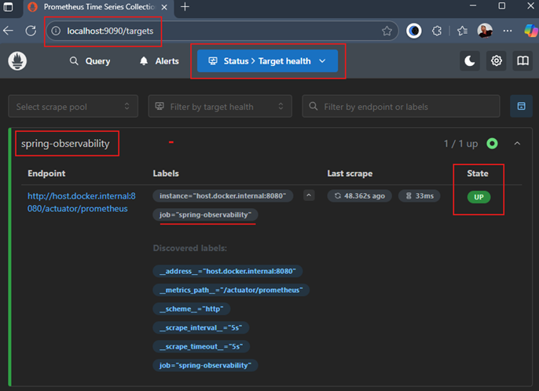

## Verificando Grafana

Accedemos a la interfaz web de `Grafana`:

- URL: `http://localhost:3000`
- Iniciamos sesión con las credenciales definidas en el `compose.yml`
    - Usuario: `admin`
    - Contraseña: `admin`

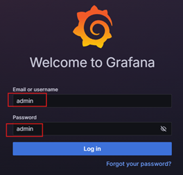

### Configurar el Data Source en Grafana

- Agregamos un `data source`.

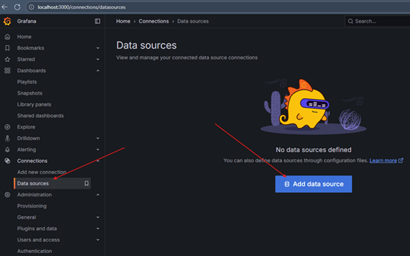

- En nuestro caso seleccionamos `Prometheus`.

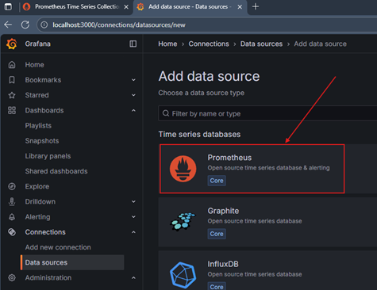

- En el campo `URL` colocamos `http://s-prometheus:9090`.

> ⚠️ `Importante`: usamos `s-prometheus` porque es el `nombre del servicio dentro de la red de Docker`. No uses
> localhost, ya que `Grafana` está dentro de un contenedor y necesita comunicarse por nombre de servicio.

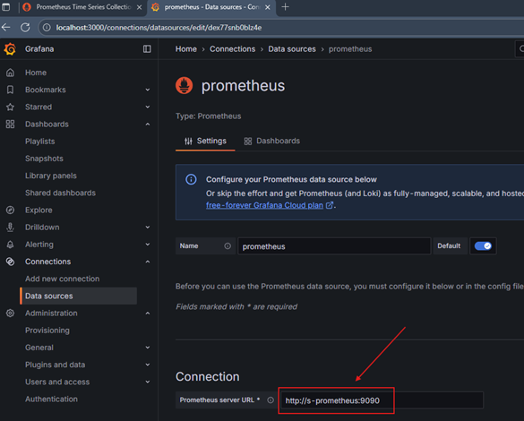

- Damos clic en `Save & test` debe decir `Data source is working`.

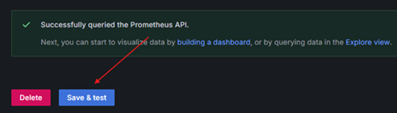

Con esto, ya tenemos `Prometheus` recolectando métricas y `Grafana` listo para visualizarlas. En el siguiente
apartado, podemos documentar cómo crear dashboards básicos, importar plantillas o construir paneles personalizados
para visualizar métricas como `http_server_requests`, `jvm_memory_used_bytes`, etc.

## Viendo métricas

Con los contenedores y la aplicación Spring Boot en ejecución, ya podemos comenzar a visualizar las métricas
recolectadas. En este apartado mostramos dos formas de hacerlo, comenzando por la más técnica: directamente desde la
interfaz de `Prometheus` y como opción 2, lo veremos en `Grafana`.

## Opción 1: Ver métricas directamente en Prometheus (Más Técnico)

Prometheus ofrece una interfaz web donde puedes ejecutar consultas `PromQL` para explorar las métricas en tiempo real.

### Generar tráfico para activar métricas HTTP

Antes de consultar métricas HTTP, generamos tráfico hacia la aplicación para que Micrometer registre datos:

1. Creamos 3 órdenes, ejecutamos 3 veces el siguiente comando con productos distintos.

````bash
$ curl -v -X POST -H "Content-type: application/json" -d "{\"product\": \"Laptop Lenovo\", \"price\": 3500.00, \"quantity\": 2}" http://localhost:8080/api/v1/orders | jq
````

2. Listamos dos veces las órdenes con el siguiente comando.

````bash
$ curl -v http://localhost:8080/api/v1/orders | jq
````

3. Buscamos una orden que no exista para generar el error 404. Ejecutamos 6 veces.

````bash
$ curl -v http://localhost:8080/api/v1/orders/1879e601-86a3-41a5-944a-c3f416efxxxx | jq
````

### Consultas PromQL en Prometheus

Vamos a la web de Prometheus (http://localhost:9090), seleccionamos la pestaña `Graph` y probamos las siguientes
consultas:

- Latencia promedio por endpoint. Calcula el tiempo promedio de respuesta por URI en los últimos 60 segundos.

````bash
sum(rate(http_server_requests_seconds_sum[1m])) by (uri)/sum(rate(http_server_requests_seconds_count[1m])) by (uri) 
````

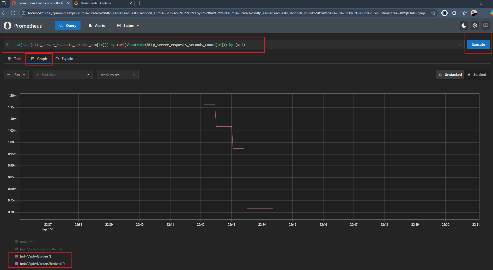

- RPS (requests por segundo) por endpoint. Muestra la tasa de peticiones por URI, método HTTP y código de estado.

````bash
sum(rate(http_server_requests_seconds_count[1m])) by (uri, method, status)
````

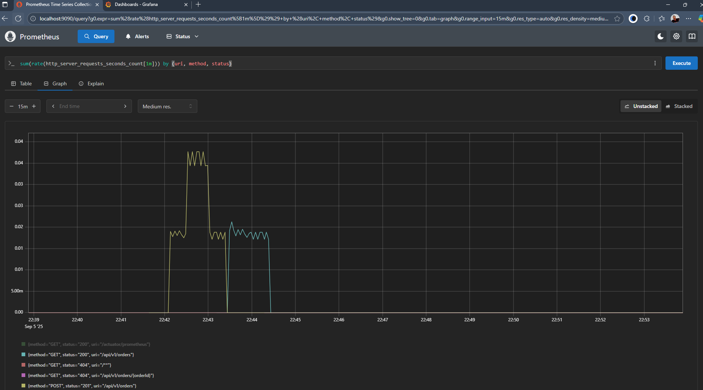

- Errores 4xx por URI. Filtra solo los errores 4xx (cliente) y los agrupa por URI.

````bash
sum(rate(http_server_requests_seconds_count{status=~"4.."}[1m])) by (uri)
````

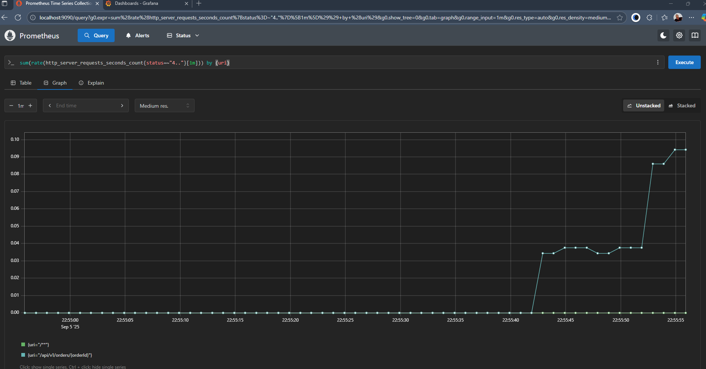

- Muestra el uso actual de memoria heap. Muestra la cantidad de memoria heap usada por la JVM en bytes.

````bash
jvm_memory_used_bytes{area="heap"} 
````

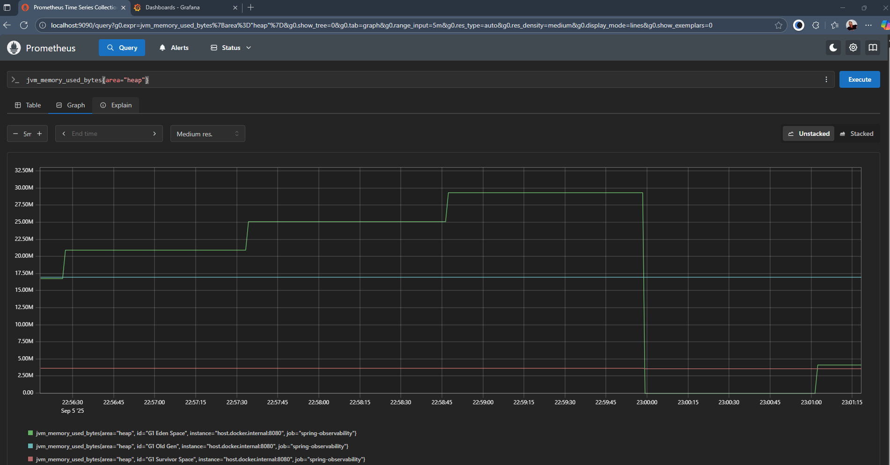

- Muestra el porcentaje de CPU usado. Indica el uso reciente de CPU del sistema donde corre la aplicación.

````bash
system_cpu_usage
````


Estas consultas te permiten validar que las métricas están siendo recolectadas correctamente, y te dan una base sólida
para construir dashboards en Grafana.

## Opción 2: Importar dashboard predefinido (Más Fácil)

`Grafana` permite importar dashboards preconfigurados desde su catálogo oficial, lo que facilita visualizar métricas
sin tener que construir paneles desde cero.

### Importar dashboard para Spring Boot

- En la interfaz de Grafana, ve al menú lateral izquierdo, selecciona `Dashboards` y haz clic en `“New” → “Import”`.

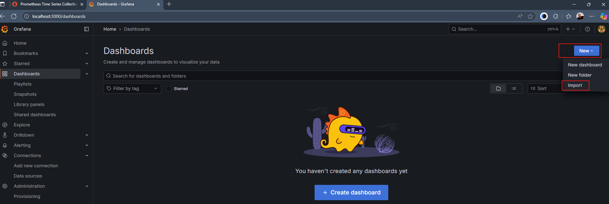

- Ingresa el ID del dashboard oficial para Spring Boot, en nuestro caso
  será [12900](https://grafana.com/grafana/dashboards/12900-springboot-apm-dashboard/)

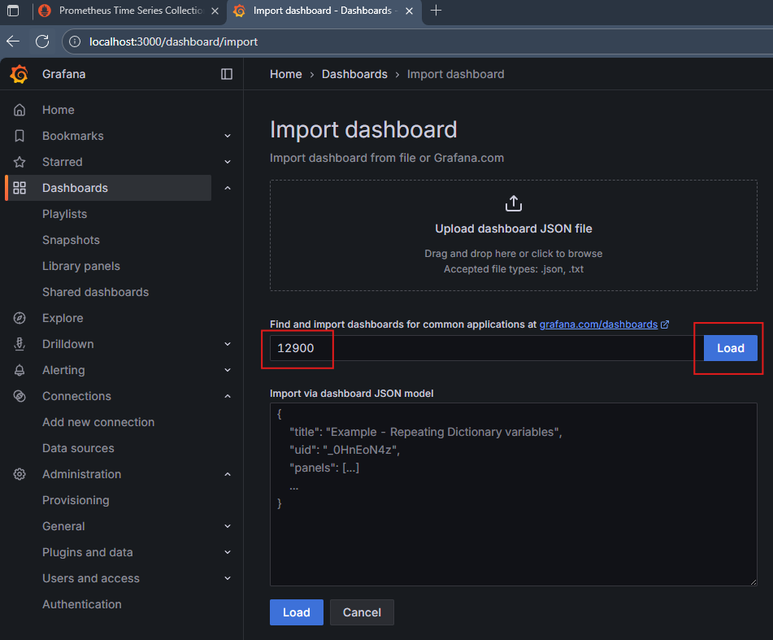

### Configurar el dashboar

- Click "Load" (imagen anterior)
- Selecciona tu data source `Prometheus`

> ⚠️ Recuerda: si configuraste tu data source con el nombre `Prometheus`, debe aparecer en la lista. Si usaste otro
> nombre, asegúrate de seleccionarlo correctamente.

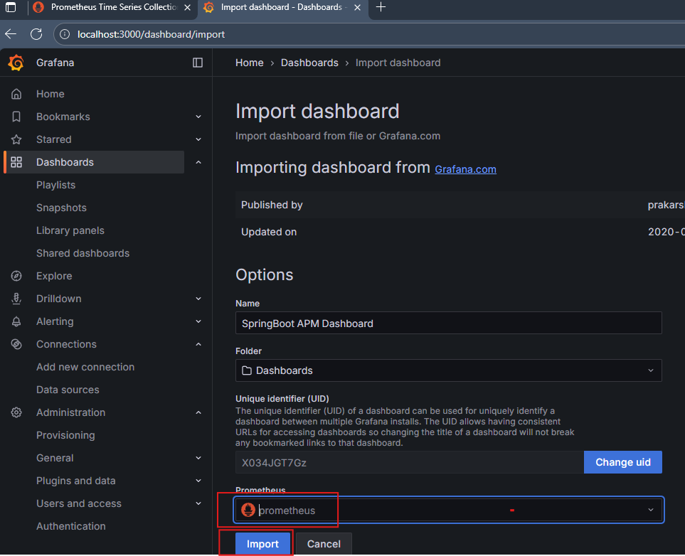

- Click "Import". Luego nos mostrará un dashboard que ya tiene todo configurado para Spring Boot.

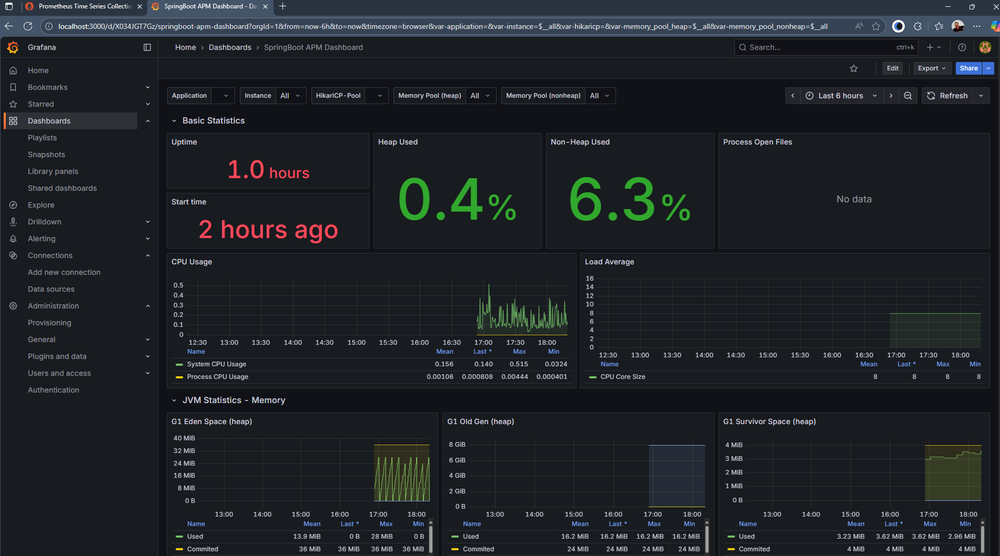

### Resultado

`Grafana` cargará un dashboard completo con paneles ya configurados para visualizar métricas como:

- Latencia por endpoint
- RPS (requests por segundo)
- Errores HTTP
- Uso de CPU y memoria
- Actividad de hilos y GC

Este dashboard es una excelente base para comenzar a explorar métricas de Spring Boot sin necesidad de construir paneles
manualmente.

# Fase 2 – Métricas Personalizadas con Micrometer

En la fase anterior, obtuvimos métricas automáticas (HTTP, JVM, sistema, etc.). Eso está bien, pero no nos dice nada
del negocio. Por ejemplo:

- ¿Cuántas órdenes se crean por producto?
- ¿Cuál es el valor total de órdenes creadas?
- ¿Cuánto tiempo toma crear una orden?

Para eso usamos `métricas personalizadas`.

## 🎯 Tipos de métricas personalizadas en Micrometer

Micrometer permite instrumentar métricas manuales que reflejan el comportamiento del negocio y del sistema. A
continuación se detallan los principales tipos, con definiciones técnicas, ejemplos y recomendaciones de uso.

### 1. `Counter` - Contadores acumulativos

Métrica que `solo incrementa`. Ideal para contar eventos discretos que no se revierten.

- No se puede decrementar.
- Se reinicia al reiniciar la aplicación (a menos que se persista externamente).

Uso típico: Conteo de eventos, errores, accesos, transacciones. Por ejemplo:

````bash
orders_created_total          // Total de orders creados
orders_search_notfound_total  // Total de búsquedas fallidas  
orders_value_high_total       // Orders de alto valor (>S/500)
````

### 2. `Gauge` - Indicadores de valor instantáneo

Métrica que representa un valor que puede subir o bajar en tiempo real.

- Se actualiza con cada `scrape` de `Prometheus`.
- Puede vincularse a colecciones, variables o funciones.

Uso típico: Estado actual de recursos, tamaños de listas, valores calculados. Por ejemplo:

````bash
orders_current_count          // Orders actuales en memoria
orders_total_value            // Valor total de orders en memoria
orders_average_price          // Precio promedio actual
````

### 3. `Timer` - Medición de duración + conteo

Métrica que mide el tiempo de ejecución de bloques de código o métodos, y cuenta cuántas veces se ejecutan.

- Reporta duración promedio, percentiles, y tasa de ejecución.
- Compatible con anotación `@Timed` o código imperativo.

Uso típico: Medición de performance, latencia, tiempos de respuesta. Por ejemplo:

````bash
orders_creation_duration      // Tiempo específico de creación
orders_validation_duration    // Tiempo de validación de datos
orders_serialization_duration // Tiempo de conversión JSON
````

### 4. `DistributionSummary` - Histograma de valores

Métrica que registra la distribución de valores numéricos (sin duración), útil para analizar rangos y percentiles.

- Similar a Timer, pero para valores arbitrarios (no tiempo).
- Reporta conteo, suma, media, percentiles

Uso típico: Análisis de dispersión, valores extremos, comportamiento agregado. Por ejemplo:

````bash
orders_price_distribution     // Distribución de precios
orders_quantity_distribution  // Distribución de cantidades 
````

## Dependencias

Ya tienes `spring-boot-starter-actuator` y `micrometer-registry-prometheus`.
> 👉 No necesitas agregar nada más para instrumentar manualmente.

## 📈 Métrica personalizada: Contador de órdenes creadas `(Counter)`

En esta sección instrumentamos una métrica personalizada que cuenta cuántas órdenes se han creado en el sistema. Usamos
el tipo `Counter`, ideal para eventos acumulativos que no se revierten.

### 🧩 ¿Qué es `MeterRegistry`?

Es el `registro central de métricas en Micrometer`. A través de él se crean e instancian métricas como `Counter`,
`Gauge`, `Timer`, etc. `Spring Boot` lo configura automáticamente cuando se incluyen las dependencias de `Actuator`
y `Prometheus`.

````java

@Slf4j
@RestController
@RequestMapping(path = "/api/v1/orders")
public class OrderController {

    private final Map<String, Order> orders = new ConcurrentHashMap<>();
    private final Counter orderCreatedCounter;

    public OrderController(MeterRegistry registry) {
        // Creamos un Counter personalizado
        this.orderCreatedCounter = Counter.builder("orders_total")
                .description("Total de órdenes creadas")
                .register(registry);
    }

    @GetMapping
    public ResponseEntity<List<Order>> getAllOrders() {
        return ResponseEntity.ok(new ArrayList<>(this.orders.values()));
    }

    @GetMapping(path = "/{orderId}")
    public ResponseEntity<Order> getOrder(@PathVariable String orderId) {
        return Optional.ofNullable(this.orders.get(orderId))
                .map(ResponseEntity::ok)
                .orElseGet(() -> ResponseEntity.notFound().build());
    }

    @PostMapping
    public ResponseEntity<Order> createOrder(@RequestBody Order request) {
        String orderId = UUID.randomUUID().toString();
        Order order = new Order(orderId, request.product(), request.price(), request.quantity());
        this.orders.put(orderId, order);

        // Incrementa el contador cada vez que se crea una orden
        log.info("Incrementando el counter");
        this.orderCreatedCounter.increment();

        return ResponseEntity.status(HttpStatus.CREATED).body(order);
    }
}
````

📌 ¿Qué hicimos?

- Creamos un `Counter` con nombre `orders_total`.
- `.register(registry)`, registra la métrica en el `MeterRegistry` para que sea recolectada.
- Cada vez que se crea una orden → `counter.increment()`.
- Aparecerá en `/actuator/prometheus` algo así:

````bash
# HELP orders_total Total de órdenes creadas
# TYPE orders_total counter
orders_total 100.0
````

## Probando Métrica personalizada: Contador de órdenes creadas `(Counter)`

Creamos un `Script de Shell` llamado `test-orders.sh` donde agregaremos código para poder ejecutar 100 request con un
solo clic, así automatizamos la inserción de registros.

````bash
#!/bin/bash

# Lista de productos disponibles
products=("Mouse" "Teclado" "Monitor" "Laptop" "Auriculares")

for i in {1..100} ; do
  # Seleccionar producto aleatorio
  product=${products[$RANDOM % ${#products[@]}]}

  # Precio aleatorio entre 10 y 500 (con dos decimales)
  price=$(awk -v min=10 -v max=500 'BEGIN{srand(); printf "%.2f", min+rand()*(max-min)}')

  # Cantidad aleatoria entre 1 y 5
  quantity=$(( (RANDOM % 5) + 1 ))

  curl -s -X POST -H "Content-type: application/json" \
    -d "{\"product\": \"${product}\", \"price\": ${price}, \"quantity\": ${quantity}}" \
     http://192.168.1.7:8080/api/v1/orders \
     > /dev/null

  echo "[${i}] Orden enviada: ${product} - ${price} PEN - Cantidad: ${quantity}"
done 
````

> Como la aplicación de Spring Boot se está ejecutando en Windows y me estoy conectando desde
> `WSL (Subsistema de Windows para Linux)`, debemos usar la dirección IP de nuestra máquina Windows en lugar
> de `localhost`. La IP `192.168.1.7` utilizada en este ejemplo es una dirección de red local que puede variar.
> Para encontrar la IP de tu computadora, ejecuta `ipconfig` en el Símbolo del sistema de Windows
> (sección `Ethernet adapter Ethernet`).

A continuación, ejecutamos el siguiente comando `wsl` para poder ejecutar el archivo `test-orders.sh`.

````bash
D:\programming\spring\15.martin_diaz\spring-observability (main -> origin)
$ wsl -d Ubuntu
````

Ejecutamos nuestra aplicación de `spring-observability` y procedemos a insertar los 100 registros ejecutando
el script de shell `test-orders.sh`.

````bash
magadiflo@SysEngJava:/mnt/d/programming/spring/15.martin_diaz/spring-observability/scripts$ ./test-orders.sh
[1] Orden enviada: Auriculares - 18.80 PEN - Cantidad: 1
...
[99] Orden enviada: Monitor - 444.94 PEN - Cantidad: 5
[100] Orden enviada: Laptop - 444.94 PEN - Cantidad: 5 
````

Si hacemos una consulta a `prometheus` veremos nuestra métrica `orders_total` junto a la cantidad de solicitudes
registradas.

````bash
$ D:\programming\spring\15.martin_diaz\spring-observability (main -> origin)
$ curl -v http://localhost:8080/actuator/prometheus
>
< HTTP/1.1 200
< Content-Type: text/plain;version=0.0.4;charset=utf-8
< Content-Length: 13145
< Date: Mon, 08 Sep 2025 22:54:58 GMT
<
...
# HELP orders_total Total de órdenes creadas
# TYPE orders_total counter
orders_total 100.0
...
````

Si vamos a `http://localhost:9090/graph` y escribimos `sum(orders_total)`, veremos el total acumulado (100).

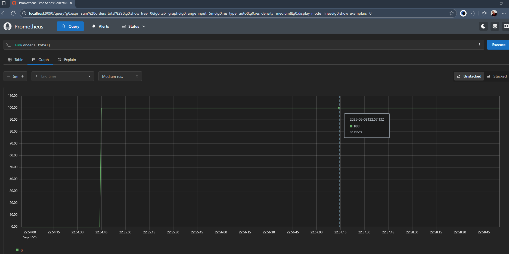

Si vamos a grafana podemos hacer la misma consulta `PromQL`, por ejemplo `sum(orders_total)`.

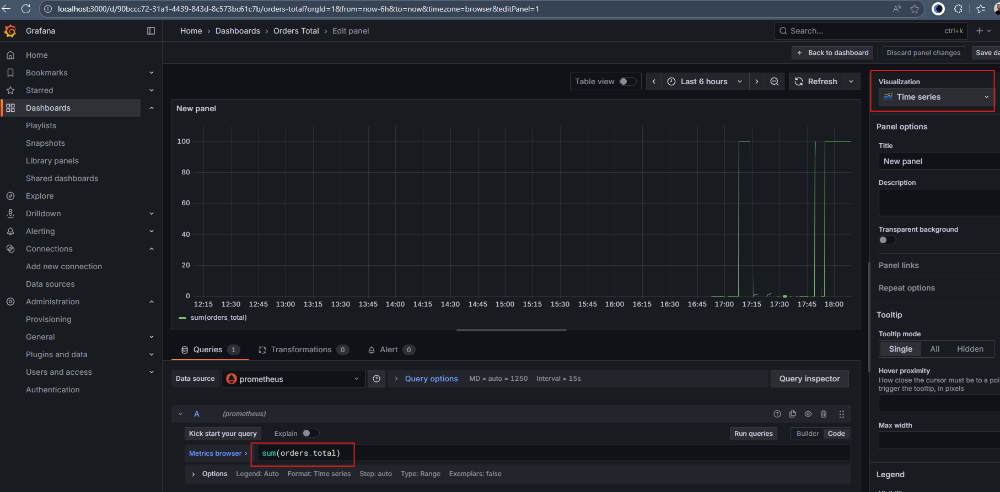
