# Logs - Segundo pilar de la observabilidad

La observabilidad moderna se apoya en tres pilares fundamentales: `métricas`, `logs` y `traces`.
En esta sección nos enfocaremos en el segundo: los `logs`.

---

## ¿Qué son los Logs en Observabilidad?

- Los `logs` son `registros de eventos` producidos por tu aplicación y su infraestructura.
- A diferencia de las métricas (que son valores numéricos agregados), los logs son detallados,
  `representan eventos específicos`: errores, peticiones, warnings, pasos en un proceso, etc.
- Suelen responder al `qué pasó` y el `por qué pasó`, mientras que las `métricas` responden al `cuánto pasó`.

Ejemplo:

- `Métrica`: `orders_total = 5`
- `Log`: `"2025-09-09 15:30:45 INFO OrderController - Nueva orden creada con id=123 y producto=Laptop"`

## Niveles de Logs (Log Levels)

Los frameworks de logging usan diferentes niveles de severidad:

````bash
TRACE < DEBUG < INFO < WARN < ERROR 
````

- `TRACE`: Información muy detallada para debugging profundo.
- `DEBUG`: Información útil para desarrollo y debugging.
- `INFO`: Eventos importantes del flujo normal de la aplicación.
- `WARN`: Situaciones potencialmente problemáticas.
- `ERROR`: Errores que no detienen la aplicación.

## Características de buenos Logs

### Logs no estructurados (texto plano)

````bash
2024-01-15 10:30:15 INFO Order 12345 created for product Laptop with price 999.99
````

### Logs estructurados (JSON)

````json
{
  "timestamp": "2024-01-15T10:30:15Z",
  "level": "INFO",
  "message": "Order created",
  "orderId": "12345",
  "product": "Laptop",
  "price": 999.99,
  "userId": "user123"
}
````

## Opciones de Logs con Spring Boot

Con tu stack `Loki + Grafana`, puedes enfocarte en:

### (A) Logs “normales” con Logback (por defecto en Spring Boot)

- No necesitas configurar mucho, Loki puede recolectarlos leyendo los stdout de los contenedores Docker.
- También puedes usar `Promtail` para recolectar logs desde archivos si prefieres no depender del logging driver de
  Docker.
- Menos flexibles para análisis avanzado, pero fácil de empezar.

### (B) Logs estructurados (JSON)

- Configurar `logback-spring.xml` para producir logs en `JSON`.
- Loki puede parsearlos mejor → permite búsquedas por campos (orderId, level, etc.).
- Muy recomendado en entornos productivos.

## Frameworks de Logging en Spring Boot

`Spring Boot` viene con `Logback` `por defecto`, pero puedes usar otros frameworks:

### Logback (Default)

Framework de logging sucesor de Log4j, desarrollado por el mismo equipo. Es la `opción por defecto` en Spring Boot
debido a su estabilidad, performance y facilidad de configuración.

### Log4j2

Framework de `logging más reciente` de Apache, diseñado desde cero para alta performance y funcionalidades avanzadas.
Requiere configuración adicional para usarlo en Spring Boot.

### Java Util Logging (JUL)

Framework de logging nativo de Java, incluido en el JDK. Raramente usado en aplicaciones Spring Boot debido a sus
limitaciones comparado con `Logback` y `Log4j2`.

## 🔍 Comparativa: `Logback` vs `Log4j2` en Spring Boot

| **Aspecto**                  | **Logback**                              | **Log4j2**                                               |
|------------------------------|------------------------------------------|----------------------------------------------------------|
| **Estado en Spring Boot**    | ✅ **Default** - Incluido automáticamente | ⚠️ Requiere exclusión de Logback + dependencia adicional |
| **Configuración**            | `logback-spring.xml` o `logback.xml`     | `log4j2-spring.xml` o `log4j2.xml`                       |
| **Performance**              | Muy buena                                | ✅ **Mejor** - Especialmente en alta concurrencia         |
| **Asynchronous Logging**     | ✅ Soporte con `AsyncAppender`            | ✅ **Superior** - Async por defecto, menos overhead       |
| **Garbage Collection**       | Genera algo de GC pressure               | ✅ **Mejor** - Garbage-free logging                       |
| **Configuración Hot Reload** | ✅ Automática cuando cambia el archivo    | ✅ Automática cuando cambia el archivo                    |
| **Filtros**                  | Soporte básico                           | ✅ **Más avanzado** - Filtros más flexibles               |
| **Plugins/Extensibilidad**   | Limitada                                 | ✅ **Superior** - Arquitectura de plugins                 |
| **Configuración JSON**       | ✅ Via programática o XML                 | ✅ **Nativo** - Soporte JSON/YAML directo                 |
| **Structured Logging**       | ✅ Con configuración adicional            | ✅ **Mejor soporte** nativo                               |
| **Lookup Variables**         | Variables básicas                        | ✅ **Más opciones** - Sistema avanzado de lookups         |
| **Compatibility**            | ✅ **Excelente** con Spring Boot          | ✅ Buena - Requiere configuración adicional               |
| **Curva de Aprendizaje**     | ✅ **Más simple** - Menos opciones        | ⚠️ Más compleja - Más opciones y features                |
| **Documentación**            | ✅ Muy buena                              | ✅ Muy buena                                              |
| **Ecosistema Spring**        | ✅ **Integración perfecta**               | ⚠️ Buena pero requiere setup manual                      |
| **Tamaño de Dependencias**   | ✅ **Más liviano**                        | ⚠️ Más pesado                                            |
| **Configuración para Loki**  | ✅ Simple con JSON encoder                | ✅ Simple con JSON layout                                 |
| **Community Support**        | ✅ Muy amplia                             | ✅ Muy amplia                                             |

### 📊 Recomendaciones según caso de uso

**Usa `Logback` cuando:**

- ✅ Estás empezando con observabilidad.
- ✅ Quieres la configuración más simple posible.
- ✅ Tu aplicación no tiene extrema alta concurrencia.
- ✅ Prefieres el path de menor resistencia en Spring Boot.

**Usa `Log4j2` cuando:**

- ✅ Necesitas máxima performance en alta concurrencia.
- ✅ Requieres logging asíncrono intensivo.
- ✅ Necesitas filtros avanzados o configuración compleja.
- ✅ Garbage collection es crítico en tu aplicación.
- ✅ Ya tienes experiencia con logging frameworks.

## Definiendo Secuencia de Pasos - Implementación de Logs

### FASE 1A: Logback - Logs No Estructurados

1. **Paso 1 – Configuración del framework de logging:**
    - Configurar `logback-spring.xml` para logs de texto plano
    - No necesitas dependencias adicionales (ya incluido en Spring Boot)

2. **Paso 2 – Generar logs en la aplicación:**
    - Usar `@Slf4j` (Lombok) para emitir logs en distintos niveles
    - Agregar logs variados en OrderController (INFO, WARN, ERROR, DEBUG)

3. **Paso 3 – Configurar la infraestructura:**
    - Agregar Loki al `compose.yml`
    - Agregar Promtail (para recolectar logs)
    - Configurar Promtail para enviar logs a Loki

4. **Paso 4 – Flujo de logs:**
    - App escribe logs a stdout/console
    - Promtail recoge logs del contenedor Docker
    - Promtail envía a Loki con labels automáticos

5. **Paso 5 – Visualización en Grafana:**
    - Configurar Loki como datasource
    - Crear queries por level (INFO, WARN, ERROR)
    - Crear dashboards básicos con LogQL
    - Ejemplos de filtros:
        - Por nivel: `{level="INFO"}`
        - Por servicio: `{app="spring-observability"}`
        - Búsqueda de texto: `{app="spring-observability"} |= "orderId"`

### FASE 1B: Logback - Logs Estructurados (JSON)

1. **Paso 1 – Modificar configuración:**
    - Actualizar `logback-spring.xml` para formato JSON
    - Mantener el mismo código Java (sin cambios)

2-5. **Pasos 2-5:** Repetir flujo anterior, observando diferencias en Grafana

### FASE 2A: Log4j2 - Logs No Estructurados

1. **Paso 1 – Migrar framework:**
    - Excluir Logback de dependencias Spring Boot
    - Agregar dependencia Log4j2
    - Configurar `log4j2-spring.xml` para texto plano
    - Mismo código Java (sin cambios)

2-5. **Pasos 2-5:** Repetir flujo, comparando con Logback

### FASE 2B: Log4j2 - Logs Estructurados (JSON)

1. **Paso 1 – Modificar configuración:**
    - Actualizar `log4j2-spring.xml` para formato JSON

2-5. **Pasos 2-5:** Repetir flujo final

---

# FASE 1A: Logback - Logs No Estructurados

## FASE 1A | Paso 1 – Configuración del framework de logging

`Spring Boot` ya trae `Logback` por defecto, así que realmente no necesitamos agregar dependencias extra.
En `logs` de texto plano, podemos usar la configuración por defecto, pero si queremos personalizar el formato
(`timestamp`, `nivel`, `clase`, `mensaje`, etc.) podemos crear un archivo `src/main/resources/logback-spring.xml`,
aunque si no ponemos este archivo, `Spring Boot` usará su propia configuración por defecto (muy similar).

### Configuración base en `logback-spring.xml`

En nuestro caso crearemos el archivo `logback-spring.xml` donde emitiremos logs en formato texto plano
(no estructurado), tanto en consola como en archivos `.log`, preparando el terreno para su posterior recolección con
`Promtail` y visualización con `Grafana`.

````xml
<?xml version="1.0" encoding="UTF-8"?>
<configuration>
    <!-- Propiedad de Spring -->
    <springProperty scope="context" name="LOG_PATH" source="logging.file.path" defaultValue="./logs"/>
    <springProperty scope="context" name="APP_NAME" source="spring.application.name" defaultValue="app"/>

    <!-- Patrón común para los logs -->
    <property name="LOG_PATTERN" value="%d{yyyy-MM-dd HH:mm:ss.SSS} [%thread] %-5level %logger{36} - %msg%n"/>

    <!-- Appender: Consola -->
    <appender name="CONSOLE" class="ch.qos.logback.core.ConsoleAppender">
        <encoder>
            <pattern>${LOG_PATTERN}</pattern>
        </encoder>
    </appender>

    <!-- Appender: Archivo con rotación diaria -->
    <appender name="FILE" class="ch.qos.logback.core.rolling.RollingFileAppender">
        <file>${LOG_PATH}/${APP_NAME}.log</file>
        <rollingPolicy class="ch.qos.logback.core.rolling.TimeBasedRollingPolicy">
            <fileNamePattern>${LOG_PATH}/${APP_NAME}_%d{yyyy-MM-dd}.log</fileNamePattern>
            <maxHistory>7</maxHistory>
        </rollingPolicy>
        <encoder>
            <pattern>${LOG_PATTERN}</pattern>
        </encoder>
    </appender>

    <!-- Logger raíz con nivel INFO -->
    <root level="INFO">
        <appender-ref ref="CONSOLE"/>
        <appender-ref ref="FILE"/>
    </root>
</configuration>
````

🧠 Detalles clave

- `logback-spring.xml` permite usar propiedades de `Spring Boot` (`logging.file.path`, `spring.application.name`)
  y perfiles (`<springProfile>` si lo necesitamos).
- `RollingFileAppender` `rota los archivos` por fecha y `conserva 7 días`.
- Puedes ajustar el nivel raíz (`INFO`, `DEBUG`, etc.).
- Explicación del patrón usado en el `pattern`:

| Componente                    | Significado                            |
|-------------------------------|----------------------------------------|
| `%d{yyyy-MM-dd HH:mm:ss.SSS}` | Timestamp (fecha y hora del log)       |
| `%-5level`                    | Nivel del log (INFO, WARN, etc.)       |
| `[%thread]`                   | Nombre del hilo                        |
| `%logger{36}`                 | Nombre del logger (máx. 36 caracteres) |
| `%msg`                        | Mensaje del log                        |
| `%n`                          | Nueva línea                            |

### 🧩 ¿Por qué usar ambos appenders?

- `ConsoleAppender`: imprime los logs en la consola del IDE, útil para desarrollo y depuración en tiempo real.
- `RollingFileAppender`: es una subclase especializada de `FileAppender` que guarda los logs en archivos `.log`,
  permitiendo persistencia, análisis posterior y recolección por herramientas como `Promtail`. A diferencia del
  `FileAppender` básico, este appender permite rotar los archivos automáticamente por fecha y
  `conservarlos durante 7 días`, lo que facilita el manejo de logs históricos sin saturar el disco.

### 📌 Ejemplo de log generado

Si ejecutamos nuestra aplicación `spring-observability` veremos que se nos creará el siguiente directorio y archivo en
la raíz de nuestro proyecto: `./logs/spring-observability.log`, el cual contiene el siguiente log con el siguiente
formato (lo mismo veremos en consola del IDE).

````bash
2025-09-10 17:50:08.745 [main] INFO  d.m.o.a.SpringObservabilityApplication - Starting SpringObservabilityApplication using Java 21.0.6 with PID 21092 (D:\programming\spring\15.martin_diaz\spring-observability\target\classes started by magadiflo in D:\programming\spring\15.martin_diaz\spring-observability)
2025-09-10 17:50:08.745 [main] DEBUG d.m.o.a.SpringObservabilityApplication - Running with Spring Boot v3.5.5, Spring v6.2.10
2025-09-10 17:50:08.745 [main] INFO  d.m.o.a.SpringObservabilityApplication - No active profile set, falling back to 1 default profile: "default"
2025-09-10 17:50:10.520 [main] INFO  o.s.b.w.e.tomcat.TomcatWebServer - Tomcat initialized with port 8080 (http)
2025-09-10 17:50:10.531 [main] INFO  o.a.coyote.http11.Http11NioProtocol - Initializing ProtocolHandler ["http-nio-8080"]
2025-09-10 17:50:10.535 [main] INFO  o.a.catalina.core.StandardService - Starting service [Tomcat]
2025-09-10 17:50:10.535 [main] INFO  o.a.catalina.core.StandardEngine - Starting Servlet engine: [Apache Tomcat/10.1.44]
2025-09-10 17:50:10.595 [main] INFO  o.a.c.c.C.[Tomcat].[localhost].[/] - Initializing Spring embedded WebApplicationContext
2025-09-10 17:50:10.597 [main] INFO  o.s.b.w.s.c.ServletWebServerApplicationContext - Root WebApplicationContext: initialization completed in 1779 ms
2025-09-10 17:50:11.487 [main] INFO  o.s.b.a.e.web.EndpointLinksResolver - Exposing 3 endpoints beneath base path '/actuator'
2025-09-10 17:50:11.549 [main] INFO  o.a.coyote.http11.Http11NioProtocol - Starting ProtocolHandler ["http-nio-8080"]
2025-09-10 17:50:11.584 [main] INFO  o.s.b.w.e.tomcat.TomcatWebServer - Tomcat started on port 8080 (http) with context path '/'
2025-09-10 17:50:11.599 [main] INFO  d.m.o.a.SpringObservabilityApplication - Started SpringObservabilityApplication in 3.892 seconds (process running for 4.627)
2025-09-10 17:50:14.011 [http-nio-8080-exec-3] INFO  o.a.c.c.C.[Tomcat].[localhost].[/] - Initializing Spring DispatcherServlet 'dispatcherServlet'
2025-09-10 17:50:14.011 [http-nio-8080-exec-3] INFO  o.s.web.servlet.DispatcherServlet - Initializing Servlet 'dispatcherServlet'
2025-09-10 17:50:14.011 [http-nio-8080-exec-3] INFO  o.s.web.servlet.DispatcherServlet - Completed initialization in 0 ms
````

> 🔒 `Nota`: En el archivo `.gitignore` estoy ignorando el directorio `logs/`, donde se genera el archivo
> `spring-observability.log`. Esto evita que los archivos de log —que son temporales, pesados y específicos del
> entorno local— se incluyan en el control de versiones.
>
> Además, al tratarse de archivos que cambian constantemente, incluirlos en `Git` podría generar ruido innecesario en
> los commits y conflictos en equipos de trabajo.

### 🧭 Escenarios de Recolección de Logs con Promtail

- `Escenario 1`: App en Local + Promtail en Docker
    ````
    Spring Boot (local) → escribe logs en archivos .log
    Promtail (Docker) → accede a los archivos montados como volumen
    Promtail → envía logs a Loki
    Grafana → consulta a Loki y visualiza los logs 
    ````
  La aplicación corre fuera de Docker, por lo que los logs deben guardarse en archivos `(FileAppender)`. `Promtail` los
  lee desde esos archivos montados como volumen y los envía a `Loki`.


- `Escenario 2`: App en Docker + Promtail en Docker
    ````
    Spring Boot (Docker) → imprime logs en consola (stdout)
    Promtail (Docker) → accede al stdout del contenedor vía docker.sock
    Promtail → envía logs a Loki
    Grafana → consulta a Loki y visualiza los logs
    ````
  La aplicación corre dentro de Docker, por lo que basta con imprimir los logs en consola (`ConsoleAppender`).
  `Promtail` accede al `stdout` del contenedor y recolecta los logs sin necesidad de archivos.

### 🧠 Conclusión

Para mi aprendizaje y documentación, seguiré el `Escenario 1`, ya que mi aplicación corre en local. Esto me permitirá:

- Validar la generación de logs en archivos.
- Configurar `Promtail` para leer esos archivos.
- Visualizar los logs en `Grafana` con queries `LogQL`.

## FASE 1A | Paso 2 – Generar logs en la aplicación

En este paso vamos a enriquecer el controlador `OrderController` con distintos niveles de logs.
La idea es cubrir los casos típicos de uso: mensajes informativos, advertencias, errores y detalles de depuración.

📌 Tipos de logs agregados

- `log.info()` → Para eventos importantes y operaciones exitosas (flujo normal de negocio).
- `log.debug()` → Para información detallada útil en depuración.
- `log.warn()` → Para situaciones sospechosas o inesperadas pero no críticas.
- `log.error()` → Para errores y excepciones que requieren atención.

### Código de ejemplo actualizado

````java

@Slf4j
@RestController
@RequestMapping(path = "/api/v1/orders")
public class OrderController {

    private final Map<String, Order> orders = new ConcurrentHashMap<>();
    private final Counter orderCreatedCounter;

    public OrderController(MeterRegistry registry) {
        // Creamos un Counter personalizado
        this.orderCreatedCounter = Counter.builder("orders_total")
                .description("Total de órdenes creadas")
                .register(registry);
    }

    @GetMapping
    public ResponseEntity<List<Order>> getAllOrders() {
        log.info("Obteniendo todas las órdenes. Total actual: {}", this.orders.size());
        return ResponseEntity.ok(new ArrayList<>(this.orders.values()));
    }

    @GetMapping(path = "/{orderId}")
    public ResponseEntity<Order> getOrder(@PathVariable String orderId) {
        log.info("Buscando orden con ID: {}", orderId);

        return Optional.ofNullable(this.orders.get(orderId))
                .map(order -> {
                    log.debug("Orden encontrada: {}", order);
                    return ResponseEntity.ok(order);
                })
                .orElseGet(() -> {
                    log.warn("Orden con ID: {} no encontrada", orderId);
                    return ResponseEntity.notFound().build();
                });
    }

    @PostMapping
    public ResponseEntity<Order> createOrder(@RequestBody Order request) {
        try {
            // Validación simple para generar diferentes tipos de logs
            if (request.price().compareTo(BigDecimal.ZERO) <= 0) {
                log.error("Error: Precio inválido recibido: {}", request.price());
                return ResponseEntity.badRequest().build();
            }

            String orderId = UUID.randomUUID().toString();
            Order order = new Order(orderId, request.product(), request.price(), request.quantity());
            this.orders.put(orderId, order);
            log.info("Nueva orden creada: {}", order);

            // Incrementa el contador cada vez que se crea una orden
            log.info("Incrementando el counter");
            this.orderCreatedCounter.increment();

            return ResponseEntity.status(HttpStatus.CREATED).body(order);
        } catch (Exception e) {
            log.error("Error inesperado al crear orden: {}", e.getMessage(), e);
            return ResponseEntity.internalServerError().build();
        }
    }
}
````

### ⚙️ Activar nivel `DEBUG` en `application.yml`

Por defecto, `Spring Boot` solo muestra en consola los niveles: `INFO`, `WARN` y `ERROR`.
Los mensajes `DEBUG` (y `TRACE`) no se ven a menos que los habilitemos explícitamente.

Para habilitar `DEBUG` en toda la aplicación o en un paquete específico, agrega lo siguiente a `application.yml`:

````yml
logging:
  level:
    dev.magadiflo.observability.app: debug
````

`Nota`: `dev.magadiflo.observability.app` corresponde al paquete raíz de tu aplicación
(donde está `SpringObservabilityApplication.java`).

### 📊 Resumen de visibilidad según nivel configurado

| Nivel configurado | Logs visibles en consola        |
|-------------------|---------------------------------|
| `info` (default)  | INFO, WARN, ERROR               |
| `debug`           | DEBUG, INFO, WARN, ERROR        |
| `trace`           | TRACE, DEBUG, INFO, WARN, ERROR |

💡 Nota adicional

Cuando usamos `log.error("Mensaje", e)`, `Logback` imprimirá el stack trace completo de la excepción `e`,
lo que resulta muy útil para diagnósticos.

## FASE 1A | Paso 3 – Configurar la infraestructura

En este paso añadiremos los servicios necesarios para trabajar con logs: `Loki` (almacenamiento) y
`Promtail` (recolección). La aplicación seguirá escribiendo logs a consola `(stdout)`. `Promtail` se encargará de
leer esos logs y enviarlos a `Loki`.

### Actualizar `Docker Compose`

Partiendo del archivo `compose.yml` que ya tenía `Prometheus` y `Grafana`, añadimos `Loki` y `Promtail`.

````yml
services:
  s-prometheus:
    image: prom/prometheus:v3.5.0
    container_name: c-prometheus
    restart: unless-stopped
    ports:
      - '9090:9090'
    volumes:
      - ./prometheus/prometheus.yml:/etc/prometheus/prometheus.yml
    networks:
      - observability-net

  s-grafana:
    image: grafana/grafana:12.1.1
    container_name: c-grafana
    restart: unless-stopped
    ports:
      - '3000:3000'
    environment:
      GF_SECURITY_ADMIN_USER: admin
      GF_SECURITY_ADMIN_PASSWORD: admin
    networks:
      - observability-net

  s-loki:
    image: grafana/loki:3.5.5
    container_name: c-loki
    restart: unless-stopped
    ports:
      - '3100:3100'
    networks:
      - observability-net

  s-promtail:
    image: grafana/promtail:3.5.5
    container_name: c-promtail
    restart: unless-stopped
    volumes:
      - ./promtail/promtail.yml:/etc/promtail/promtail.yml
      - ./../logs:/var/log/spring-app
    command: [ '-config.file=/etc/promtail/promtail.yml' ]
    networks:
      - observability-net

networks:
  observability-net:
    name: observability-net
````

#### Sobre el servicio `Loki` (`s-loki`)

- `Loki` actúa como el almacenamiento central de logs.
- Todo lo que recoja `Promtail` será enviado a `Loki` por su endpoint HTTP `(http://s-loki:3100)`.
- Luego `Grafana` se conecta a este servicio para consultar los logs con `LogQL`.

#### Sobre el servicio `Promtail` (`s-promtail`)

- `Promtail` es el agente recolector:
    - `Lee los logs` de un directorio montado en `/var/log/spring-app` (en este caso, `./../logs` en tu host).
    - Usa un archivo de configuración `(promtail.yml)` donde definiremos:
        - `Scrape jobs` (qué archivos leer).
        - `Labels` (ej. `app="spring-observability"`).
        - `Destino` (el servicio Loki).
- Sobre el `command: [ '-config.file=/etc/promtail/promtail.yml' ]`
    - Con esta instrucción le decimos explícitamente a `Promtail` que arranque usando un archivo de configuración
      ubicado en la ruta `/etc/promtail/promtail.yml` dentro del contenedor.
    - Sin embargo, este archivo no está escrito directamente dentro de la imagen, sino que lo montamos desde el host
      con este volumen: `- ./promtail/promtail.yml:/etc/promtail/promtail.yml`.
    - Esto significa que el archivo real que tú editas es `./promtail/promtail.yml` (en tu proyecto, en tu máquina),
      pero cuando se levanta el contenedor ese archivo aparece “mapeado” en la ruta `/etc/promtail/promtail.yml`.
    - En otras palabras:
        - Ruta en host: `./promtail/promtail.yml`
        - Ruta en contenedor: `/etc/promtail/promtail.yml`
    - De esa manera, cualquier cambio que hagas en el archivo local se reflejará directamente en la configuración que
      usa `Promtail` al reiniciar el contenedor.
- Sobre el bind mount `./../logs:/var/log/spring-app`
    - Este bind mount hace que la carpeta `./../logs` de tu máquina se monte dentro del contenedor en
      `/var/log/spring-app`.
    - De esa forma, `Promtail` puede leer directamente los archivos de logs generados por la aplicación desde la ruta
      interna `/var/log/spring-app`, aunque realmente estén en tu host.

### Crear archivo de configuración de Promtail

Creamos el archivo de configuración `promtail.yml` el cual fue definido en el volumen del servicio `s-promtail`.
Este archivo lo ubicamos en la ruta `docker/promtail/promtail.yml`.

````yml
server:
  http_listen_port: 9080
  grpc_listen_port: 0

positions:
  filename: /tmp/positions.yaml

clients:
  - url: http://s-loki:3100/loki/api/v1/push

scrape_configs:
  - job_name: spring-app
    static_configs:
      - targets: [ 'localhost' ]
        labels:
          job: spring-logs
          app: spring-observability
          __path__: /var/log/spring-app/*.log
````

- `http_listen_port: 9080`, define en qué puerto se expone `Promtail` para métricas y debugging (9080).
- `grpc_listen_port: 0`, desactiva el servidor gRPC (no lo necesitamos).
- `positions.filename: /tmp/positions.yaml`, `Promtail` guarda aquí la posición de lectura de los logs, con esto evita
  que al reiniciar lea los archivos completos desde el inicio.
- `clients`, define el destino donde se envían los logs.
- `url: http://s-loki:3100/loki/api/v1/push`, auí se indica la dirección del servicio de `Loki` al que `Promtail`
  enviará los logs. `s-loki` corresponde al nombre del servicio en Docker Compose, que automáticamente se resuelve como
  hostname dentro de la red `observability-net`.
- `scrape_configs`
    - `job_name`: nombre lógico del `job` (para referencia en `métricas/logs`).
    - `static_configs`: define las rutas de logs que `Promtail` debe leer.
        - `targets`: requerido pero no usado aquí (se deja como `localhost`).
        - `labels`: etiquetas asociadas a los logs.
            - `job`: nombre del conjunto de logs (aquí `spring-logs`).
            - `app`: etiqueta para identificar la aplicación `(spring-observability)`.
            - `__path__`: ruta en el contenedor donde `Promtail` busca archivos de logs `(/var/log/spring-app/*.log)`.
    - En nuestro caso, la ruta `/var/log/spring-app/*.log` corresponde al `bind mount` definido en `compose.yml`:
      `./../logs:/var/log/spring-app`. Es decir, todo lo que tu aplicación escriba en `./../logs` en tu máquina host
      será visible para `Promtail` en `/var/log/spring-app` dentro del contenedor.

### Flujo completo

El recorrido que siguen los logs en esta infraestructura es el siguiente:

1. `Spring Boot`
    - La aplicación genera logs (texto plano en esta fase).
    - Estos logs se escriben en el archivo `spring-observability.log`, dentro del directorio que compartimos con
      Docker (`./../logs` → `/var/log/spring-app` en el contenedor).

2. `Promtail`
    - Lee los logs desde la ruta `/var/log/spring-app/*.log` (gracias al `bind mount` configurado).
    - Asigna etiquetas (`job`, `app`, etc.) a cada línea de log.
    - Envía los logs hacia `Loki` usando el endpoint `http://s-loki:3100/loki/api/v1/push`.

3. `Loki`
    - Recibe y almacena los logs indexados por las etiquetas (`job`, `app`, `level`, etc.).
    - Los prepara para que puedan ser consultados mediante `LogQL`.

4. `Grafana (se verá en el Paso 5)`
    - Consume a `Loki` como data source.
    - Permite construir consultas, filtrar por etiquetas o texto libre, y visualizar los logs en dashboards.

📌 En resumen:
> Spring Boot (logs) → Promtail (recolección y envío) → Loki (almacenamiento e indexado) → Grafana (visualización)

### Levantar contenedores con `Docker Compose`

En este punto ya podemos levantar los contendores ejecutando el comando de docker compose tal como se muestra a
continuación.

````bash
D:\programming\spring\15.martin_diaz\spring-observability (main -> origin)
$ docker compose -f ./docker/compose.yml up -dd                                                                 
````

Listamos todos los contenedores para ver si están en estado `UP`.

````bash
$ docker container ls -a
CONTAINER ID   IMAGE                    COMMAND                  CREATED          STATUS          PORTS                                         NAMES
475e6374d7d2   grafana/promtail:3.5.5   "/usr/bin/promtail -…"   19 seconds ago   Up 15 seconds                                                 c-promtail
22e537addf18   prom/prometheus:v3.5.0   "/bin/prometheus --c…"   19 seconds ago   Up 15 seconds   0.0.0.0:9090->9090/tcp, [::]:9090->9090/tcp   c-prometheus
e97d20ce502f   grafana/grafana:12.1.1   "/run.sh"                19 seconds ago   Up 15 seconds   0.0.0.0:3000->3000/tcp, [::]:3000->3000/tcp   c-grafana
b2d058d0279b   grafana/loki:3.5.5       "/usr/bin/loki -conf…"   19 seconds ago   Up 15 seconds   0.0.0.0:3100->3100/tcp, [::]:3100->3100/tcp   c-loki
````

Si vemos los logs de `c-promteil` veremos que todo está en ok.

````bash
docker container logs c-promtail
level=info ts=2025-09-12T20:25:37.46206126Z caller=promtail.go:135 msg="Reloading configuration file" sha3sum=764e5c381586bbb0d0d498cf4879f2cb9f90ad5050c1d0595b937faec89a802c
level=info ts=2025-09-12T20:25:37.512052977Z caller=server.go:368 msg="server listening on addresses" http=[::]:9080 grpc=[::]:36589
level=info ts=2025-09-12T20:25:37.51223996Z caller=main.go:173 msg="Starting Promtail" version="(version=3.5.5, branch=release-3.5.x, revision=5aa8bd27)"
level=warn ts=2025-09-12T20:25:37.51239466Z caller=promtail.go:265 msg="enable watchConfig"
level=info ts=2025-09-12T20:25:42.463599577Z caller=filetargetmanager.go:373 msg="Adding target" key="/var/log/spring-app/*.log:{app=\"spring-observability\", job=\"spring-logs\"}" 
````

> Si vemos la línea `Adding target` significa que `Promtail` detectó correctamente los archivos de log definidos en la
> ruta `/var/log/spring-app/*.log` y está enviándolos a `Loki`.

Lo mismo con el contenedor `c-loki`

````bash
λ docker container logs c-loki
level=info ts=2025-09-12T20:25:37.401519285Z caller=main.go:126 msg="Starting Loki" version="(version=3.5.5, branch=release-3.5.x, revision=5aa8bd27)"
level=info ts=2025-09-12T20:25:37.401567602Z caller=main.go:127 msg="Loading configuration file" filename=/etc/loki/local-config.yaml
level=info ts=2025-09-12T20:25:37.43055381Z caller=server.go:368 msg="server listening on addresses" http=[::]:3100 grpc=[::]:9095
...
level=info ts=2025-09-12T20:26:05.197571199Z caller=recalculate_owned_streams.go:52 msg="completed recalculate owned streams job"
level=info ts=2025-09-12T20:26:32.82358155Z caller=table_manager.go:136 index-store=tsdb-2020-10-24 msg="uploading tables"
level=info ts=2025-09-12T20:26:32.889596525Z caller=recalculate_owned_streams.go:49 msg="starting recalculate owned streams job"
level=info ts=2025-09-12T20:26:32.889625342Z caller=recalculate_owned_streams.go:52 msg="completed recalculate owned streams job"
level=info ts=2025-09-12T20:27:00.580898729Z caller=recalculate_owned_streams.go:49 msg="starting recalculate owned streams job"
level=info ts=2025-09-12T20:27:00.580935996Z caller=recalculate_owned_streams.go:52 msg="completed recalculate owned streams job" 
````

> Si `Loki` inició correctamente, veremos el mensaje `server listening on addresses http=[::]:3100`, lo que confirma
> que está listo para recibir logs desde `Promtail`.

## 📊 Métricas vs 📜 Logs – Flujo de Datos en Observabilidad

Aunque tanto métricas como logs terminan en Grafana, el camino que siguen es diferente.

### Métricas (Micrometer + Prometheus)

- `Micrometer` (integrado en Spring Boot) expone métricas en un endpoint HTTP: `/actuator/prometheus`
- `Prometheus` es quien viene y las extrae `(pull)`.
- Flujo:
    ````bash
    Spring Boot (Micrometer) --exposición--> /actuator/prometheus
                ↑
                Prometheus hace scraping (pull)
    ````

### Logs (Promtail + Loki)

- La aplicación escribe logs en consola o archivos.
- `Promtail` los lee y los empuja `(push)` a `Loki`.
- `Loki` almacena y organiza esos logs para consultas posteriores.
- Flujo:
    ````bash
    Spring Boot --stdout/logs--> Promtail --push--> Loki
    ````

### 🔑 Diferencia clave

- En `métricas`, `Micrometer` es la pieza que expone datos y `Prometheus` los extrae `(pull)`.
- En `logs`, la aplicación solo escribe a `consola/archivo → Promtail` los recoge y los envía a `Loki (push)`.

## FASE 1A | Paso 4 – Flujo de logs

En este paso levantaremos la aplicación y realizaremos algunas peticiones a los endpoints de `OrderController`.

El objetivo es generar logs reales (de tipo `INFO`, `DEBUG`, `WARN`, `ERROR`) y comprobar que estos fluyen
correctamente hasta `Loki`, sin necesidad de `Grafana` todavía.

### 1. Levantar la infraestructura

Verificamos que todos los contenedores estén corriendo.

````bash
$ docker container ls -a
CONTAINER ID   IMAGE                    COMMAND                  CREATED       STATUS       PORTS                                         NAMES
475e6374d7d2   grafana/promtail:3.5.5   "/usr/bin/promtail -…"   2 hours ago   Up 2 hours                                                 c-promtail
22e537addf18   prom/prometheus:v3.5.0   "/bin/prometheus --c…"   2 hours ago   Up 2 hours   0.0.0.0:9090->9090/tcp, [::]:9090->9090/tcp   c-prometheus
e97d20ce502f   grafana/grafana:12.1.1   "/run.sh"                2 hours ago   Up 2 hours   0.0.0.0:3000->3000/tcp, [::]:3000->3000/tcp   c-grafana
b2d058d0279b   grafana/loki:3.5.5       "/usr/bin/loki -conf…"   2 hours ago   Up 2 hours   0.0.0.0:3100->3100/tcp, [::]:3100->3100/tcp   c-loki
````

### 2. Levantar la aplicación Spring Boot

Ejecutamos la aplicación normalmente (desde el IDE o con `mvn spring-boot:run`). Por defecto, la app escribirá sus logs
en consola y también en el archivo log ubicado en `logs/spring-observability.log`, la cual es leída por `Promtail` y
enviada a `Loki`.

Verificamos que el archivo `spring-observability.log` se esté generando correctamente en la ruta establecida.

````bash
D:\programming\spring\15.martin_diaz\spring-observability (main -> origin)
$ ls -l logs/
total 4
-rw-r--r-- 1 magadiflo 197121 2261 Sep 12 17:09 spring-observability.log
````

Podemos observar el contenido generado luego de iniciar la aplicación.

````bash
2025-09-12 17:09:43.517 [main] INFO  d.m.o.a.SpringObservabilityApplication - Starting SpringObservabilityApplication using Java 21.0.6 with PID 14348 (D:\programming\spring\15.martin_diaz\spring-observability\target\classes started by magadiflo in D:\programming\spring\15.martin_diaz\spring-observability)
2025-09-12 17:09:43.519 [main] DEBUG d.m.o.a.SpringObservabilityApplication - Running with Spring Boot v3.5.5, Spring v6.2.10
2025-09-12 17:09:43.520 [main] INFO  d.m.o.a.SpringObservabilityApplication - No active profile set, falling back to 1 default profile: "default"
2025-09-12 17:09:45.216 [main] INFO  o.s.b.w.e.tomcat.TomcatWebServer - Tomcat initialized with port 8080 (http)
2025-09-12 17:09:45.231 [main] INFO  o.a.coyote.http11.Http11NioProtocol - Initializing ProtocolHandler ["http-nio-8080"]
2025-09-12 17:09:45.234 [main] INFO  o.a.catalina.core.StandardService - Starting service [Tomcat]
2025-09-12 17:09:45.234 [main] INFO  o.a.catalina.core.StandardEngine - Starting Servlet engine: [Apache Tomcat/10.1.44]
2025-09-12 17:09:45.306 [main] INFO  o.a.c.c.C.[Tomcat].[localhost].[/] - Initializing Spring embedded WebApplicationContext
2025-09-12 17:09:45.307 [main] INFO  o.s.b.w.s.c.ServletWebServerApplicationContext - Root WebApplicationContext: initialization completed in 1706 ms
2025-09-12 17:09:46.188 [main] INFO  o.s.b.a.e.web.EndpointLinksResolver - Exposing 3 endpoints beneath base path '/actuator'
2025-09-12 17:09:46.248 [main] INFO  o.a.coyote.http11.Http11NioProtocol - Starting ProtocolHandler ["http-nio-8080"]
2025-09-12 17:09:46.283 [main] INFO  o.s.b.w.e.tomcat.TomcatWebServer - Tomcat started on port 8080 (http) with context path '/'
2025-09-12 17:09:46.311 [main] INFO  d.m.o.a.SpringObservabilityApplication - Started SpringObservabilityApplication in 3.903 seconds (process running for 5.437)
2025-09-12 17:09:49.290 [http-nio-8080-exec-2] INFO  o.a.c.c.C.[Tomcat].[localhost].[/] - Initializing Spring DispatcherServlet 'dispatcherServlet'
2025-09-12 17:09:49.290 [http-nio-8080-exec-2] INFO  o.s.web.servlet.DispatcherServlet - Initializing Servlet 'dispatcherServlet'
2025-09-12 17:09:49.291 [http-nio-8080-exec-2] INFO  o.s.web.servlet.DispatcherServlet - Completed initialization in 0 ms
````

### 3. Realizar peticiones de prueba

Crear una orden válida (log `INFO`)

````bash
$ curl -v -X POST -H "Content-type: application/json" -d "{\"product\": \"Tablet\", \"price\": 10, \"quantity\": 10}" http://localhost:8080/api/v1/orders | jq
>
< HTTP/1.1 201
< Content-Type: application/json
< Transfer-Encoding: chunked
< Date: Fri, 12 Sep 2025 22:16:14 GMT
<
{
  "orderId": "f1b76011-116b-4e88-a94a-b0adde65820b",
  "product": "Tablet",
  "price": 10,
  "quantity": 10
}
````

````bash
2025-09-12 17:16:14.888 [http-nio-8080-exec-3] INFO  d.m.o.app.controller.OrderController - Nueva orden creada: Order[orderId=f1b76011-116b-4e88-a94a-b0adde65820b, product=Tablet, price=10, quantity=10]
2025-09-12 17:16:14.896 [http-nio-8080-exec-3] INFO  d.m.o.app.controller.OrderController - Incrementando el counter 
````

Crear una orden inválida (log `ERROR`)

````bash
$ curl -v -X POST -H "Content-type: application/json" -d "{\"product\": \"Tablet\", \"price\": 0, \"quantity\": 10}" http://localhost:8080/api/v1/orders | jq
>
< HTTP/1.1 400
< Content-Length: 0
< Date: Fri, 12 Sep 2025 22:19:21 GMT
< Connection: close
<
````

````bash
2025-09-12 17:19:21.661 [http-nio-8080-exec-10] ERROR d.m.o.app.controller.OrderController - Error: Precio inválido recibido: 0
````

Consultar una orden existente (log `INFO` + `DEBUG`)

````bash
$ curl -v http://localhost:8080/api/v1/orders/f1b76011-116b-4e88-a94a-b0adde65820b | jq
>
< HTTP/1.1 200
< Content-Type: application/json
< Transfer-Encoding: chunked
< Date: Fri, 12 Sep 2025 22:23:01 GMT
<
{
  "orderId": "f1b76011-116b-4e88-a94a-b0adde65820b",
  "product": "Tablet",
  "price": 10,
  "quantity": 10
}
````

````bash
2025-09-12 17:23:01.382 [http-nio-8080-exec-9] INFO  d.m.o.app.controller.OrderController - Buscando orden con ID: f1b76011-116b-4e88-a94a-b0adde65820b
2025-09-12 17:23:01.383 [http-nio-8080-exec-9] DEBUG d.m.o.app.controller.OrderController - Orden encontrada: Order[orderId=f1b76011-116b-4e88-a94a-b0adde65820b, product=Tablet, price=10, quantity=10]
````

Consultar una orden inexistente (log `INFO` + `WARN`)

````bash
$ curl -v http://localhost:8080/api/v1/orders/1234 | jq
>
< HTTP/1.1 404
< Content-Length: 0
< Date: Fri, 12 Sep 2025 22:20:36 GMT
<
````

````bash
2025-09-12 17:20:36.360 [http-nio-8080-exec-3] INFO  d.m.o.app.controller.OrderController - Buscando orden con ID: 1234
2025-09-12 17:20:36.362 [http-nio-8080-exec-3] WARN  d.m.o.app.controller.OrderController - Orden con ID: 1234 no encontrada
````

Obtener todas las órdenes (log `INFO`)

````bash
$ curl -v http://localhost:8080/api/v1/orders | jq
>
< HTTP/1.1 200
< Content-Type: application/json
< Transfer-Encoding: chunked
< Date: Fri, 12 Sep 2025 22:21:14 GMT
<
[
  {
    "orderId": "f1b76011-116b-4e88-a94a-b0adde65820b",
    "product": "Tablet",
    "price": 10,
    "quantity": 10
  }
]
````

````bash
2025-09-12 17:21:14.068 [http-nio-8080-exec-3] INFO  d.m.o.app.controller.OrderController - Obteniendo todas las órdenes. Total actual: 1
````

### 4. Verificar logs en el archivo spring-observability.log

Después de hacer las peticiones, revisamos el archivo `spring-observability.log`.

````bash
D:\programming\spring\15.martin_diaz\spring-observability (main -> origin)
$ cat .\logs\spring-observability.log
2025-09-12 17:09:43.517 [main] INFO  d.m.o.a.SpringObservabilityApplication - Starting SpringObservabilityApplication using Java 21.0.6 with PID 14348 (D:\programming\spring\15.martin_diaz\spring-observability\target\classes started by magadiflo in D:\programming\spring\15.martin_diaz\spring-observability)
2025-09-12 17:09:43.519 [main] DEBUG d.m.o.a.SpringObservabilityApplication - Running with Spring Boot v3.5.5, Spring v6.2.10
2025-09-12 17:09:43.520 [main] INFO  d.m.o.a.SpringObservabilityApplication - No active profile set, falling back to 1 default profile: "default"
2025-09-12 17:09:45.216 [main] INFO  o.s.b.w.e.tomcat.TomcatWebServer - Tomcat initialized with port 8080 (http)
2025-09-12 17:09:45.231 [main] INFO  o.a.coyote.http11.Http11NioProtocol - Initializing ProtocolHandler ["http-nio-8080"]
2025-09-12 17:09:45.234 [main] INFO  o.a.catalina.core.StandardService - Starting service [Tomcat]
2025-09-12 17:09:45.234 [main] INFO  o.a.catalina.core.StandardEngine - Starting Servlet engine: [Apache Tomcat/10.1.44]
2025-09-12 17:09:45.306 [main] INFO  o.a.c.c.C.[Tomcat].[localhost].[/] - Initializing Spring embedded WebApplicationContext
2025-09-12 17:09:45.307 [main] INFO  o.s.b.w.s.c.ServletWebServerApplicationContext - Root WebApplicationContext: initialization completed in 1706 ms
2025-09-12 17:09:46.188 [main] INFO  o.s.b.a.e.web.EndpointLinksResolver - Exposing 3 endpoints beneath base path '/actuator'
2025-09-12 17:09:46.248 [main] INFO  o.a.coyote.http11.Http11NioProtocol - Starting ProtocolHandler ["http-nio-8080"]
2025-09-12 17:09:46.283 [main] INFO  o.s.b.w.e.tomcat.TomcatWebServer - Tomcat started on port 8080 (http) with context path '/'
2025-09-12 17:09:46.311 [main] INFO  d.m.o.a.SpringObservabilityApplication - Started SpringObservabilityApplication in 3.903 seconds (process running for 5.437)
2025-09-12 17:09:49.290 [http-nio-8080-exec-2] INFO  o.a.c.c.C.[Tomcat].[localhost].[/] - Initializing Spring DispatcherServlet 'dispatcherServlet'
2025-09-12 17:09:49.290 [http-nio-8080-exec-2] INFO  o.s.web.servlet.DispatcherServlet - Initializing Servlet 'dispatcherServlet'
2025-09-12 17:09:49.291 [http-nio-8080-exec-2] INFO  o.s.web.servlet.DispatcherServlet - Completed initialization in 0 ms
2025-09-12 17:16:14.888 [http-nio-8080-exec-3] INFO  d.m.o.app.controller.OrderController - Nueva orden creada: Order[orderId=f1b76011-116b-4e88-a94a-b0adde65820b, product=Tablet, price=10, quantity=10]
2025-09-12 17:16:14.896 [http-nio-8080-exec-3] INFO  d.m.o.app.controller.OrderController - Incrementando el counter
2025-09-12 17:19:21.661 [http-nio-8080-exec-10] ERROR d.m.o.app.controller.OrderController - Error: Precio inválido recibido: 0
2025-09-12 17:20:36.360 [http-nio-8080-exec-3] INFO  d.m.o.app.controller.OrderController - Buscando orden con ID: 1234
2025-09-12 17:20:36.362 [http-nio-8080-exec-3] WARN  d.m.o.app.controller.OrderController - Orden con ID: 1234 no encontrada
2025-09-12 17:21:14.068 [http-nio-8080-exec-3] INFO  d.m.o.app.controller.OrderController - Obteniendo todas las órdenes. Total actual: 1
2025-09-12 17:23:01.382 [http-nio-8080-exec-9] INFO  d.m.o.app.controller.OrderController - Buscando orden con ID: f1b76011-116b-4e88-a94a-b0adde65820b
2025-09-12 17:23:01.383 [http-nio-8080-exec-9] DEBUG d.m.o.app.controller.OrderController - Orden encontrada: Order[orderId=f1b76011-116b-4e88-a94a-b0adde65820b, product=Tablet, price=10, quantity=10]
````

### 5. Consultar los logs en Loki (sin Grafana)

Antes de integrar `Grafana`, podemos validar que los logs efectivamente están siendo recolectados y almacenados en
`Loki`. Para ello, aprovechamos que `Loki` expone una `API HTTP` y hacemos consultas directamente con `curl`.

En este ejemplo pediremos los últimos `10 logs` de la aplicación con la etiqueta `app="spring-observability"`.
Usaremos el endpoint `/loki/api/v1/query_range`, que es el recomendado para obtener logs en un rango de tiempo.

Ejecutamos el siguiente comando (en `Git Bash` o cualquier terminal compatible):

````bash
$ curl --data-urlencode 'query={app="spring-observability"}' --data-urlencode 'limit=10' --data-urlencode "start=$(date -d '40 minutes ago' +%s)" --data-urlencode "end=$(date +%s)" http://localhost:3100/loki/api/v1/query_range
````

📌 Notas importantes:

- `query={app="spring-observability"}` → filtra los logs que tengan la etiqueta app con ese valor.
- `limit=10` → limita la cantidad de resultados.
- `start` y `end` → definen el rango de tiempo de búsqueda.
- `http://localhost:3100` → corresponde al puerto expuesto por el contenedor `s-loki` en Docker Compose

#### Ejemplo de respuesta formateada

El resultado es un JSON que incluye streams de logs con sus etiquetas y mensajes. A continuación un extracto
simplificado de la consulta:

````json
{
  "status": "success",
  "data": {
    "resultType": "streams",
    "result": [
      {
        "stream": {
          "app": "spring-observability",
          "detected_level": "error",
          "filename": "/var/log/spring-app/spring-observability.log",
          "job": "spring-logs"
        },
        "values": [
          [
            "1757715559453443551",
            "2025-09-12 17:19:21.661 ERROR d.m.o.app.controller.OrderController - Error: Precio inválido recibido: 0"
          ]
        ]
      },
      {
        "stream": {
          "app": "spring-observability",
          "detected_level": "info",
          "filename": "/var/log/spring-app/spring-observability.log",
          "job": "spring-logs"
        },
        "values": [
          [
            "1757715371064101883",
            "2025-09-12 17:16:14.888 INFO  d.m.o.app.controller.OrderController - Nueva orden creada: Order[orderId=..., product=Tablet, price=10, quantity=10]"
          ]
        ]
      }
    ]
  }
}
````

👉 Aquí podemos ver claramente:

- Los labels que `Promtail` asignó a cada log (`app`, `job`, `filename`).
- El campo `detected_level`, que nos indica si fue `INFO`, `DEBUG`, `WARN` o `ERROR`.
- El mensaje original emitido por nuestra aplicación.

## FASE 1A | Paso 5 – Visualización en Grafana

En este paso conectaremos `Grafana` con `Loki` y realizaremos las primeras consultas de logs usando `LogQL`.

### 1. Acceder a Grafana

Abrimos el navegador y accedemos a `http://localhost:3000` autenticándonos con el usuario `admin` y password `admin`
(según lo definido en `compose.yml`).

### 2. Configurar Loki como Data Source

- En el menú lateral izquierdo, ir a `Connections > Data sources` y hacemos clic en `Add data source`.

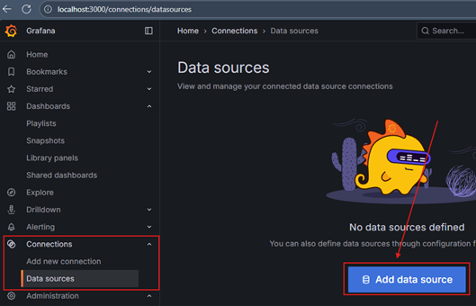

- Seleccionar Loki.

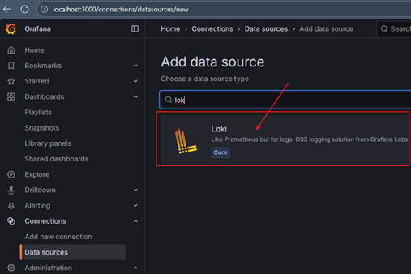

- En el campo URL, colocar `http://s-loki:3100`.

> ⚠️ `Importante`: usamos `s-loki` porque `Grafana` se comunica con `Loki` dentro de la misma red Docker
> `(observability-net)`. Si se configurara `http://localhost:3100`, `Grafana` no podría resolverlo.

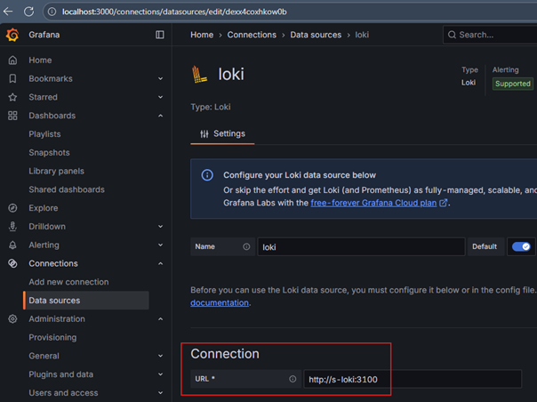

- Clic en `Save & Test`. Si todo está bien, `Grafana` confirmará que la conexión fue exitosa.

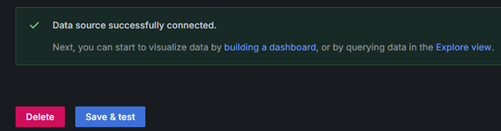

### 3. Explorar Logs con LogQL

`Grafana` trae la pestaña `Explore`, donde podemos consultar directamente los logs.

> - Entramos en `Explore`
> - Seleccionamos el `Data source`: `Loki`
> - Usamos las siguientes consultas:

### 📋 Sobre la etiqueta `{app="spring-observability"}`

> Esta etiqueta no la genera `Loki` automáticamente, sino que la definimos en el archivo de configuración de
> Promtail(`promtail.yml`).
>
> En la sección `scrape_configs`, añadimos etiquetas personalizadas `(labels)` a los logs antes de enviarlos a `Loki`:
>
> ```yaml
> scrape_configs:
>   - job_name: spring-app
>     static_configs:
>       - targets: [ 'localhost' ]
>         labels:
>           job: spring-logs
>           app: spring-observability
>           __path__: /var/log/spring-app/*.log
> ```
>
> - La directiva `__path__` indica a Promtail qué archivo(s) de logs debe leer.
> - La etiqueta `app: spring-observability` es un **metadato** que se adjunta a cada línea de log y que luego podemos
    usar en las consultas de `Loki`.
>
> Podríamos haber usado cualquier otro valor para `app` (ej. `mi-app`, `spring-logs`), pero por buena práctica usamos el
> mismo nombre de la aplicación.
>
> Gracias a estas etiquetas podemos diferenciar fácilmente los logs cuando tenemos múltiples aplicaciones o servicios
> enviando información a Loki.

### Consultas básicas con LogQL

- Todos los logs de la app: `{app="spring-observability"}`

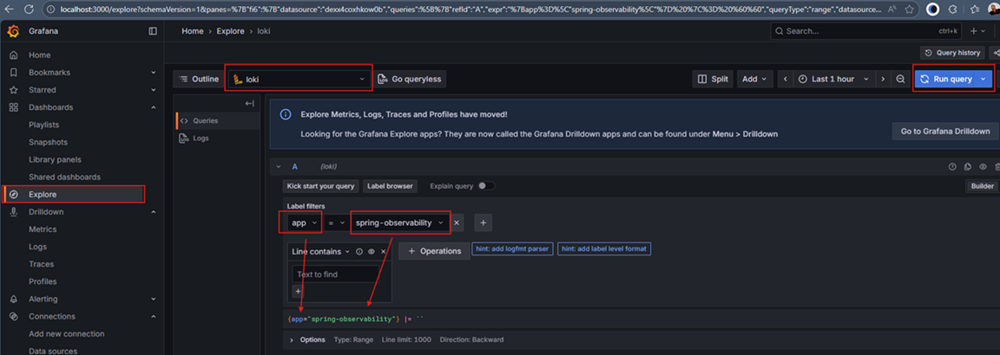

Cláramente podemos observar los logs que nuestra aplicación ha generado hasta el momento.

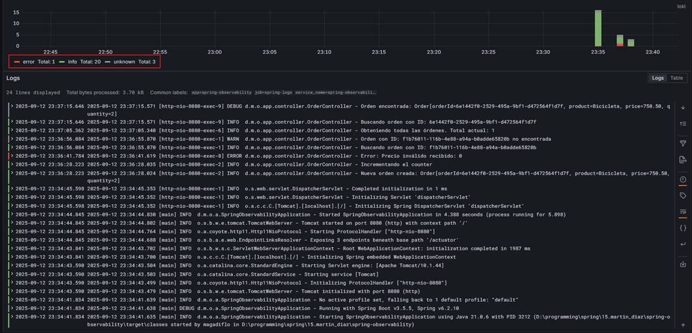

- Solo logs de `ERROR` usando el siguiente comando: `{app="spring-observability"} |= "ERROR"`.

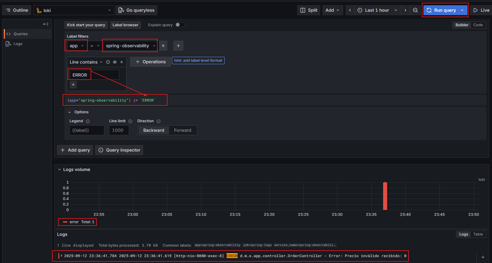

- Buscar texto dentro de los logs

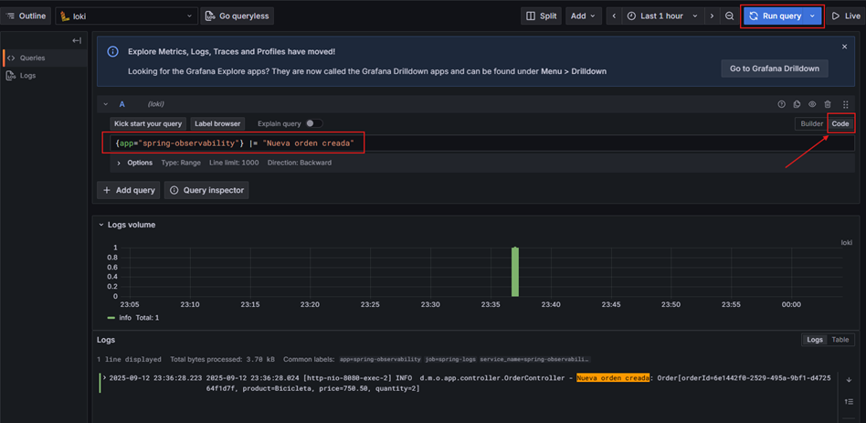

✅ Con este paso hemos cerrado la `FASE 1A (Logback - Logs No Estructurados)`. Ya tenemos:

- La app generando logs en consola y archivo.
- `Promtail` recolectando logs.
- `Loki` almacenando.
- `Grafana` visualizando con queries.

### Flujo completo funcionando

````
Spring Boot → logback-spring.xml → ./logs/spring-observability.log → Promtail → Loki → Grafana 
````

---

# FASE 1B: Logback - Logs Estructurados (JSON)

Antes de iniciar con los pasos de esta sección, vamos a reiniciar el entorno de observabilidad para partir desde cero.

📌 Primero, detenemos y eliminamos los contenedores junto con sus volúmenes. La bandera `-v` garantiza que también se
eliminen los volúmenes asociados:

````bash
D:\programming\spring\15.martin_diaz\spring-observability (main -> origin)
$ docker compose -f ./docker/compose.yml down -v                          
[+] Running 5/5                                                           
 ✔ Container c-loki           Removed                                     
 ✔ Container c-prometheus     Removed                                     
 ✔ Container c-promtail       Removed                                     
 ✔ Container c-grafana        Removed                                     
 ✔ Network observability-net  Removed                                     
````

📌 Luego, volvemos a levantar el stack de observabilidad:

````bash
D:\programming\spring\15.martin_diaz\spring-observability (main -> origin)
$ docker compose -f ./docker/compose.yml up -d                            
[+] Running 5/5                                                           
 ✔ Network observability-net  Created                                     
 ✔ Container c-prometheus     Started                                     
 ✔ Container c-grafana        Started                                     
 ✔ Container c-loki           Started                                     
 ✔ Container c-promtail       Started                                     
````

📌 Finalmente, verificamos que todos los servicios estén corriendo correctamente:

````bash
docker container ls -a
CONTAINER ID   IMAGE                    COMMAND                  CREATED          STATUS          PORTS                                         NAMES
9cc0999b3ff1   grafana/grafana:12.1.1   "/run.sh"                49 seconds ago   Up 49 seconds   0.0.0.0:3000->3000/tcp, [::]:3000->3000/tcp   c-grafana
4b6433fb3303   grafana/loki:3.5.5       "/usr/bin/loki -conf…"   49 seconds ago   Up 49 seconds   0.0.0.0:3100->3100/tcp, [::]:3100->3100/tcp   c-loki
b3a755d23b6d   grafana/promtail:3.5.5   "/usr/bin/promtail -…"   49 seconds ago   Up 49 seconds                                                 c-promtail
27ff20d51d40   prom/prometheus:v3.5.0   "/bin/prometheus --c…"   49 seconds ago   Up 49 seconds   0.0.0.0:9090->9090/tcp, [::]:9090->9090/tcp   c-prometheus
````

✅ Con esto ya tenemos nuevamente listo nuestro entorno de observabilidad para continuar con la fase de logs
estructurados en JSON.

## FASE 1B | Paso 1 – Modificar configuración de Logback para JSON

En este paso cambiamos la configuración de `Logback` para que los logs se escriban en formato `JSON`.
Esto lo logramos gracias a la librería `logstash-logback-encoder`.

### Agregar dependencia en `pom.xml`

Con esta librería, `Logback` puede serializar los logs directamente a `JSON`.

````xml

<dependencies>
    <!-- Logback a JSON -->
    <dependency>
        <groupId>net.logstash.logback</groupId>
        <artifactId>logstash-logback-encoder</artifactId>
        <version>8.1</version>
    </dependency>
</dependencies>
````

### Modificar `logback-spring.xml`

````xml
<?xml version="1.0" encoding="UTF-8"?>
<configuration>
    <!-- Propiedad de Spring -->
    <springProperty scope="context" name="LOG_PATH" source="logging.file.path" defaultValue="./logs"/>
    <springProperty scope="context" name="APP_NAME" source="spring.application.name" defaultValue="app"/>

    <!-- Patrón común para los logs -->
    <property name="LOG_PATTERN" value="%d{yyyy-MM-dd HH:mm:ss.SSS} [%thread] %-5level %logger{36} - %msg%n"/>

    <!-- Appender: Consola -->
    <appender name="CONSOLE" class="ch.qos.logback.core.ConsoleAppender">
        <encoder>
            <pattern>${LOG_PATTERN}</pattern>
        </encoder>
    </appender>

    <!-- Appender: Archivo con rotación diaria -->
    <appender name="FILE" class="ch.qos.logback.core.rolling.RollingFileAppender">
        <file>${LOG_PATH}/${APP_NAME}.log</file>
        <rollingPolicy class="ch.qos.logback.core.rolling.TimeBasedRollingPolicy">
            <fileNamePattern>${LOG_PATH}/${APP_NAME}_%d{yyyy-MM-dd}.log</fileNamePattern>
            <maxHistory>7</maxHistory>
        </rollingPolicy>
        <encoder class="net.logstash.logback.encoder.LogstashEncoder"/>
    </appender>

    <!-- Logger raíz con nivel INFO -->
    <root level="INFO">
        <appender-ref ref="CONSOLE"/>
        <appender-ref ref="FILE"/>
    </root>
</configuration>
````

Qué hicimos aquí:

- Modificamos el appender `FILE`.
- El log se guarda en `logs/spring-observability.log`.
- Usamos `LogstashEncoder` que convierte cada evento de log en `JSON estructurado`.
- El resto del código Java (tu `OrderController`, etc.) no se toca: `lo que cambia es cómo se escribe el log`.

Por defecto, con `<encoder class="net.logstash.logback.encoder.LogstashEncoder"/>` nos muestra por cada registro, un
json por `default` que incluye `@timestamp`, `level`, `logger`, `message`, etc., tal como se muestra a continuación.

````bash
{"@timestamp":"2025-09-15T15:52:07.0890736-05:00","@version":"1","message":"Nueva orden creada: Order[orderId=d3e85657-78ff-4130-b3f7-85b21f501f30, product=Tablet, price=10, quantity=10]","logger_name":"dev.magadiflo.observability.app.controller.OrderController","thread_name":"http-nio-8080-exec-5","level":"INFO","level_value":20000,"APP_NAME":"spring-observability","LOG_PATH":"./logs"}
{"@timestamp":"2025-09-15T15:52:07.098278-05:00","@version":"1","message":"Incrementando el counter","logger_name":"dev.magadiflo.observability.app.controller.OrderController","thread_name":"http-nio-8080-exec-5","level":"INFO","level_value":20000,"APP_NAME":"spring-observability","LOG_PATH":"./logs"}
````

### Personalizar JSON con `LogstashEncoder`

Para que los logs se almacenen en formato `JSON estructurado`, modificamos el `logback-spring.xml` y usamos
`LogstashEncoder`. Esto nos permite:

- Definir qué campos estarán en el JSON (`timestamp`, `level`, `thread`, etc.).
- Agregar campos personalizados (ej: `service`).
- Mantener compatibilidad con `Loki` y `Grafana`, que procesan muy bien este formato.

````xml
<?xml version="1.0" encoding="UTF-8"?>
<configuration>
    <!-- Propiedad de Spring -->
    <springProperty scope="context" name="LOG_PATH" source="logging.file.path" defaultValue="./logs"/>
    <springProperty scope="context" name="APP_NAME" source="spring.application.name" defaultValue="app"/>

    <!-- Patrón común para logs en consola (texto plano) -->
    <property name="LOG_PATTERN" value="%d{yyyy-MM-dd HH:mm:ss.SSS} [%thread] %-5level %logger{36} - %msg%n"/>

    <!-- Appender: Consola (para debugging local en texto plano) -->
    <appender name="CONSOLE" class="ch.qos.logback.core.ConsoleAppender">
        <encoder>
            <pattern>${LOG_PATTERN}</pattern>
        </encoder>
    </appender>

    <!-- Appender: Archivo con rotación diaria (JSON estructurado) -->
    <appender name="FILE" class="ch.qos.logback.core.rolling.RollingFileAppender">
        <file>${LOG_PATH}/${APP_NAME}.log</file>
        <rollingPolicy class="ch.qos.logback.core.rolling.TimeBasedRollingPolicy">
            <fileNamePattern>${LOG_PATH}/${APP_NAME}_%d{yyyy-MM-dd}.log</fileNamePattern>
            <maxHistory>7</maxHistory>
        </rollingPolicy>
        <encoder class="net.logstash.logback.encoder.LogstashEncoder">
            <!-- Incluir información de contexto (hilos, entorno) -->
            <includeContext>true</includeContext>

            <!-- Incluir información extra del MDC (ej: requestId, usuario) -->
            <includeMdc>true</includeMdc>

            <!-- Campo fijo personalizado para identificar el servicio -->
            <customFields>{"service":"${APP_NAME}"}</customFields>

            <!-- Renombrar los campos para mantener consistencia -->
            <fieldNames>
                <timestamp>timestamp</timestamp>
                <level>level</level>
                <thread>thread</thread>
                <logger>logger</logger>
                <message>message</message>
            </fieldNames>
        </encoder>
    </appender>

    <!-- Logger raíz con nivel INFO -->
    <root level="INFO">
        <appender-ref ref="CONSOLE"/>
        <appender-ref ref="FILE"/>
    </root>
</configuration>
````

🔑 Explicación rápida

- `Consola`: sigue mostrando logs en texto plano → útil en desarrollo.
- `Archivo (JSON)`: ahora guarda los logs en formato JSON estructurado, con rotación diaria.
- `Campos incluidos`: timestamp, level, thread, logger, message.
- `Campo extra`: service → identifica de qué aplicación proviene el log (en este caso, `${APP_NAME}`).

Este formato será el que `Promtail` recolecta y envía a `Loki`, y luego `Grafana` podrá consultar y filtrar fácilmente.

## FASE 1B | Paso 2 y Paso 3

En esta fase `1B` los pasos `2` y `3` ya se encuentran implementados en el proyecto (configuración de `Promtail`
y envío a `Loki`). Por lo tanto, aquí no es necesario repetirlos.

## FASE 1B | Paso 4 – Flujo de logs

Igual que en la `Fase 1A`, levantamos la aplicación y realizamos peticiones a los endpoints
(`GET /api/v1/orders`, `POST /api/v1/orders`, etc.) para que se generen logs.

````bash
$ curl -v -X POST -H "Content-type: application/json" -d "{\"product\": \"Tablet\", \"price\": 10, \"quantity\": 10}" http://localhost:8080/api/v1/orders | jq
>
< HTTP/1.1 201
< Content-Type: application/json
< Transfer-Encoding: chunked
< Date: Mon, 15 Sep 2025 21:47:30 GMT
<
{
  "orderId": "63bce1dd-73f3-465e-aa4a-b03d25631226",
  "product": "Tablet",
  "price": 10,
  "quantity": 10
}
````

````bash
$ curl -v -X POST -H "Content-type: application/json" -d "{\"product\": \"Tablet\", \"price\": 0, \"quantity\": 10}" http://localhost:8080/api/v1/orders | jq
>
< HTTP/1.1 400
< Content-Length: 0
< Date: Mon, 15 Sep 2025 21:48:01 GMT
< Connection: close
<
````

````bash
$ curl -v http://localhost:8080/api/v1/orders/888888 | jq
>
< HTTP/1.1 404
< Content-Length: 0
< Date: Mon, 15 Sep 2025 21:48:40 GMT
<
````

````bash
$ curl -v http://localhost:8080/api/v1/orders | jq
>
< HTTP/1.1 200
< Content-Type: application/json
< Transfer-Encoding: chunked
< Date: Mon, 15 Sep 2025 21:48:53 GMT
<
[
  {
    "orderId": "63bce1dd-73f3-465e-aa4a-b03d25631226",
    "product": "Tablet",
    "price": 10,
    "quantity": 10
  }
]
````

### 📌 Diferencia clave respecto a la Fase 1A:

Ahora, en lugar de tener un archivo `.log` con `texto plano`, tendremos un archivo `.log` en formato
`JSON estructurado`, lo que facilita el procesamiento, búsqueda y filtrado en `Loki/Grafana`.

Ejemplo real de los registros:

````bash
{"timestamp":"2025-09-15T16:47:30.9749302-05:00","@version":"1","message":"Nueva orden creada: Order[orderId=63bce1dd-73f3-465e-aa4a-b03d25631226, product=Tablet, price=10, quantity=10]","logger":"dev.magadiflo.observability.app.controller.OrderController","thread":"http-nio-8080-exec-6","level":"INFO","level_value":20000,"APP_NAME":"spring-observability","LOG_PATH":"./logs","service":"spring-observability"}
{"timestamp":"2025-09-15T16:47:30.980978-05:00","@version":"1","message":"Incrementando el counter","logger":"dev.magadiflo.observability.app.controller.OrderController","thread":"http-nio-8080-exec-6","level":"INFO","level_value":20000,"APP_NAME":"spring-observability","LOG_PATH":"./logs","service":"spring-observability"}
{"timestamp":"2025-09-15T16:48:01.3701253-05:00","@version":"1","message":"Error: Precio inválido recibido: 0","logger":"dev.magadiflo.observability.app.controller.OrderController","thread":"http-nio-8080-exec-5","level":"ERROR","level_value":40000,"APP_NAME":"spring-observability","LOG_PATH":"./logs","service":"spring-observability"}
{"timestamp":"2025-09-15T16:48:40.3841254-05:00","@version":"1","message":"Buscando orden con ID: 888888","logger":"dev.magadiflo.observability.app.controller.OrderController","thread":"http-nio-8080-exec-5","level":"INFO","level_value":20000,"APP_NAME":"spring-observability","LOG_PATH":"./logs","service":"spring-observability"}
{"timestamp":"2025-09-15T16:48:40.3851323-05:00","@version":"1","message":"Orden con ID: 888888 no encontrada","logger":"dev.magadiflo.observability.app.controller.OrderController","thread":"http-nio-8080-exec-5","level":"WARN","level_value":30000,"APP_NAME":"spring-observability","LOG_PATH":"./logs","service":"spring-observability"}
{"timestamp":"2025-09-15T16:48:53.9402385-05:00","@version":"1","message":"Obteniendo todas las órdenes. Total actual: 1","logger":"dev.magadiflo.observability.app.controller.OrderController","thread":"http-nio-8080-exec-3","level":"INFO","level_value":20000,"APP_NAME":"spring-observability","LOG_PATH":"./logs","service":"spring-observability"}
````

🔑 Con esto ya queda clara la transición: misma app, mismos endpoints, pero ahora los logs están listos para ser
consumidos como datos estructurados en `Loki/Grafana`.

## FASE 1B | Paso 5 – Visualización en Grafana

Como hemos vuelvo a crear el contendor de grafana, necesitamos configurar `Loki` como `Data Source`, eso lo podemos
ver gráficamente en `FASE 1A | Paso 5 – Visualización en Grafana`, así que aquí solo lo mostraré como pasos:

- En el menú lateral izquierdo, ir a `Connections` > `Data sources` y hacemos clic en `Add data source`.
- Seleccionar `Loki`.
- En el campo `URL`, colocar `http://s-loki:3100`.
- Clic en `Save & Test`. Si todo está bien, `Grafana` confirmará que la conexión fue exitosa.

### Consultas básicas con LogQL

Entramos en `Explore` → `Data source`: `Loki` y hacemos queries como:

- Todos los logs de la aplicación: `{app="spring-observability"}`

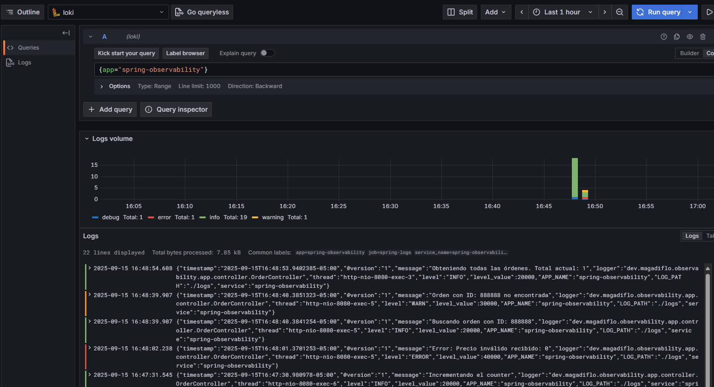

- Filtrar solo logs de nivel `ERROR` usando el campo `JSON` llamado `level`:
  `{app="spring-observability"} | json | level="ERROR"`

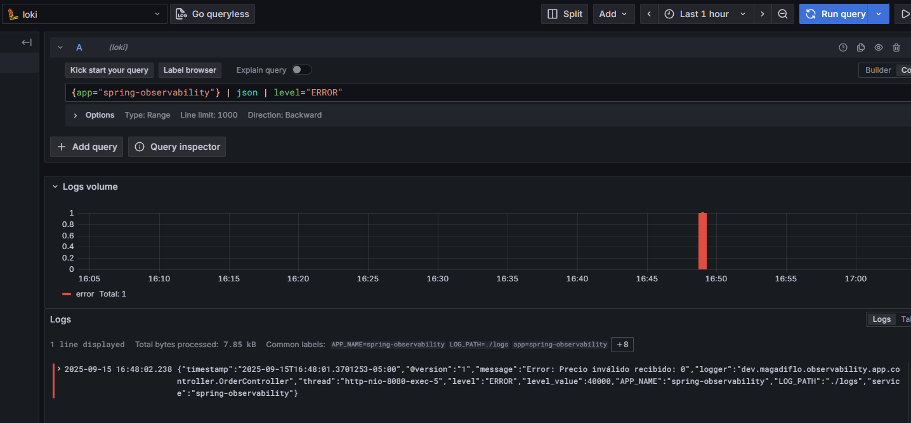

> 🔑 Diferencia clave:
> - En la `Fase 1A` filtrábamos con `cadenas de texto` (`|= "ERROR"`).
>- En la `Fase 1B` podemos filtrar directamente por `campos JSON` (`level="ERROR"`), lo cual es mucho más potente y
   preciso.

La consulta `{app="spring-observability"} | json | level="ERROR"`, ¿qué hace?

1. Usa el operador `| json` para parsear cada log como `JSON`.
2. Extrae campos (ej. `timestamp`, `level`, `message`, etc.).
3. Aplica el filtro sobre el campo estructurado `level`, no sobre el texto.
4. Es un filtro semántico, mucho más preciso y robusto.
5. Solo devolverá logs donde realmente el campo `level = "ERROR"`, independientemente del texto del mensaje.

- Filtrar logs de nivel `ERROR` o `WARN`: `{app="spring-observability"} | json | level="ERROR" or level="WARN"`

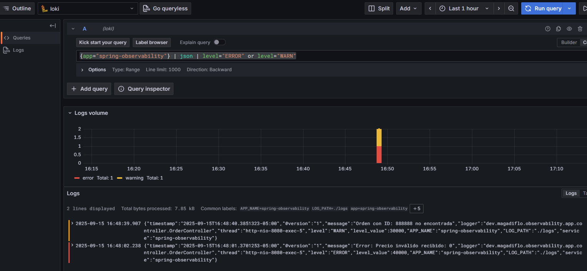

- Combinar filtros `JSON`: `{app="spring-observability"} | json | level="INFO" | service="spring-observability"`

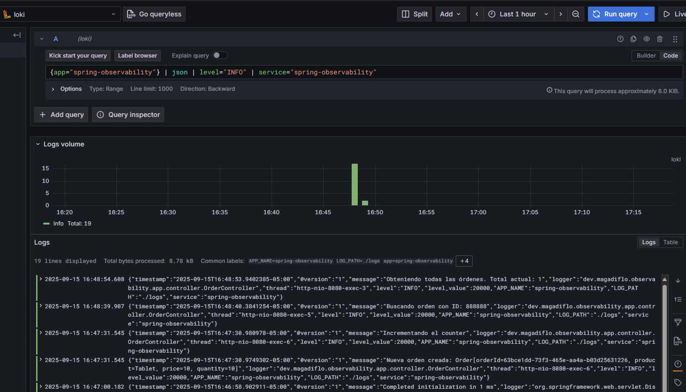


---

# FASE 2A: Log4j2 - Logs No Estructurados

La idea aquí es `migrar de Logback a Log4j2` pero manteniendo el mismo comportamiento básico: logs en texto plano (no
estructurados), de modo que podamos comparar después con `Logback`.

Antes de iniciar con los pasos de esta sección, vamos a reiniciar el entorno de observabilidad para partir desde cero.

📌 Primero, detenemos y eliminamos los contenedores junto con sus volúmenes. La bandera `-v` garantiza que también se
eliminen los volúmenes asociados:

````bash
D:\programming\spring\15.martin_diaz\spring-observability (main -> origin)
$ docker compose -f ./docker/compose.yml down -v                      
````

📌 Luego, volvemos a levantar el stack de observabilidad:

````bash
D:\programming\spring\15.martin_diaz\spring-observability (main -> origin)
$ docker compose -f ./docker/compose.yml up -d                        
````

✅ Con esto ya tenemos nuevamente listo nuestro entorno de observabilidad para continuar con una nueva fase.

## FASE 2A | Paso 1 – Migrar framework

### 1. Excluir Logback

`Spring Boot` trae `Logback` por defecto, así que hay que excluirlo desde el `starter de logging`:

````xml

<dependency>
    <groupId>org.springframework.boot</groupId>
    <artifactId>spring-boot-starter</artifactId>
    <exclusions>
        <exclusion>
            <groupId>org.springframework.boot</groupId>
            <artifactId>spring-boot-starter-logging</artifactId>
        </exclusion>
    </exclusions>
</dependency>
````

### 2. Agregar dependencia de Log4j2

Necesitamos el starter de `Log4j2` para `Spring Boot`:

````xml

<dependency>
    <groupId>org.springframework.boot</groupId>
    <artifactId>spring-boot-starter-log4j2</artifactId>
</dependency>
````

#### Dependencias finales

Luego de excluir el `Logback` que viene por defecto en Spring Boot y agregar la dependencia de `log4j2`, finalmente
nuestro `pom.xml` queda de la siguiente manera:

````xml

<dependencies>
    <dependency>
        <groupId>org.springframework.boot</groupId>
        <artifactId>spring-boot-starter-actuator</artifactId>
    </dependency>
    <dependency>
        <groupId>org.springframework.boot</groupId>
        <artifactId>spring-boot-starter-web</artifactId>
    </dependency>
    <!--  Excluímos Logback desde el starter de logging -->
    <dependency>
        <groupId>org.springframework.boot</groupId>
        <artifactId>spring-boot-starter</artifactId>
        <exclusions>
            <exclusion>
                <groupId>org.springframework.boot</groupId>
                <artifactId>spring-boot-starter-logging</artifactId>
            </exclusion>
        </exclusions>
    </dependency>
    <!-- AGREGAR Log4j2 Starter -->
    <dependency>
        <groupId>org.springframework.boot</groupId>
        <artifactId>spring-boot-starter-log4j2</artifactId>
    </dependency>

    <dependency>
        <groupId>io.micrometer</groupId>
        <artifactId>micrometer-registry-prometheus</artifactId>
        <scope>runtime</scope>
    </dependency>
    <dependency>
        <groupId>org.projectlombok</groupId>
        <artifactId>lombok</artifactId>
        <optional>true</optional>
    </dependency>
    <dependency>
        <groupId>org.springframework.boot</groupId>
        <artifactId>spring-boot-starter-test</artifactId>
        <scope>test</scope>
    </dependency>
</dependencies>
````

- `Exclusión`: `spring-boot-starter-logging` → Quita `Logback` completamente de `Spring Boot`.
- `Inclusión`: `spring-boot-starter-log4j2` → Agrega `Log4j2` como reemplazo.
- `@Slf4j` sigue funcionando → `SLF4J` ahora redirige a `Log4j2` en lugar de `Logback`.

### 3. Configurar `log4j2-spring.xml` (texto plano)

Creamos el archivo `src/main/resources/log4j2-spring.xml` con configuración equivalente a la que usábamos en `Logback`
(eliminamos el archivo `logback-spring.xml`).

````xml
<?xml version="1.0" encoding="UTF-8"?>
<configuration>
    <Properties>
        <!-- Propiedad de Spring -->
        <Property name="LOG_PATH">${spring:logging.file.path:-./logs}</Property>
        <Property name="APP_NAME">${spring:spring.application.name:-app}</Property>
        <!-- Patrón común para los logs -->
        <Property name="LOG_PATTERN">%d{yyyy-MM-dd HH:mm:ss.SSS} [%t] %-5level %logger{36} - %msg%n</Property>
    </Properties>

    <Appenders>
        <!-- Appender: Consola -->
        <Console name="CONSOLE" target="SYSTEM_OUT">
            <PatternLayout pattern="${LOG_PATTERN}"/>
        </Console>

        <!-- Appender: Archivo con rotación diaria -->
        <RollingFile name="FILE"
                     fileName="${LOG_PATH}/${APP_NAME}.log"
                     filePattern="${LOG_PATH}/${APP_NAME}_%d{yyyy-MM-dd}.log">
            <PatternLayout pattern="${LOG_PATTERN}"/>
            <Policies>
                <TimeBasedTriggeringPolicy interval="1" modulate="true"/>
            </Policies>
            <DefaultRolloverStrategy max="7"/>
        </RollingFile>
    </Appenders>

    <!-- Logger raíz con nivel INFO -->
    <Loggers>
        <root level="INFO">
            <AppenderRef ref="CONSOLE"/>
            <AppenderRef ref="FILE"/>
        </root>
    </Loggers>
</configuration>
````

1. `Uso de propiedades de Spring Boot`
    - Con `${spring:logging.file.path:-./logs}` y `${spring:spring.application.name:-app}` estás tomando los valores que
      definas en `application.yml` (`logging.file.path`, `spring.application.name`), con valores por defecto
      (`./logs` y `app`) si no existen.
    - Ese guion (`-`) delante del valor por defecto no forma parte del path. Es la
      `sintaxis estándar de Log4j2 para definir un valor por defecto` cuando la variable no existe.
    - En nuestro caso: `${spring:logging.file.path:-./logs`:
        - Si existe `logging.file.path` en tu `application.yml`, se usará ese valor.
        - Si no existe, se usará `./logs`.
        - ⚠️ El guion no se incluye en la ruta final, solo indica fallback.
    - ✅ Esto te da flexibilidad y portabilidad.


2. `Patrón común (LOG_PATTERN)`
    - Igual al de Logback: `%d{yyyy-MM-dd HH:mm:ss.SSS} [%t] %-5level %logger{36} - %msg%n`
    - ✅ Formato estándar, legible y consistente.


3. `Appender de Consola (CONSOLE)`
    - Muestra los logs en tiempo real cuando corres la app con `mvn spring-boot:run` o `java -jar`.
    - ✅ Útil para desarrollo y debugging.


4. `Appender de Archivo (RollingFile)`
    - Archivo principal: `${LOG_PATH}/${APP_NAME}.log`
    - Rotación diaria: `${LOG_PATH}/${APP_NAME}_%d{yyyy-MM-dd}.log`
    - Mantiene máximo 7 días (`<DefaultRolloverStrategy max="7"/>`).
    - ✅ Con esto tienes persistencia y no acumulas archivos infinitamente.


5. `Logger raíz (root)`
    - Nivel: `INFO`
    - Envía logs a consola y a archivo.
    - ✅ Cubre la mayoría de los casos sin configuración extra.

### Diferencias entre `log4j2.xml` y `log4j2-spring.xml` en Spring Boot

- Si usas `log4j2.xml`, Spring Boot lo carga “tal cual”, como si fuera un `Log4j2` puro → no interpreta `${spring:...}`,
  solo entiende `${sys:...}`, `${env:...}`, etc.

- Si usas `log4j2-spring.xml`, ahí entra el bridge de Spring Boot → ya puedes usar `${spring:...}` y acceder
  directamente a propiedades de tu `application.yml` o `application.properties`.

Eso sí:

- El sufijo `-spring` también le da a `Spring Boot` la posibilidad de aplicar ciertas configuraciones condicionales (ej.
  perfiles).
- Si no usas `-spring`, pierdes esas integraciones y solo queda la configuración “pura” de `Log4j2`.

👉 Por eso, en un proyecto `Spring Boot` `siempre es mejor usar log4j2-spring.xml` en lugar de `log4j2.xml`.

| Archivo             | ¿Quién lo procesa?          | Variables soportadas                                                                                                                            | Uso recomendado                                                                                                           |
|---------------------|-----------------------------|-------------------------------------------------------------------------------------------------------------------------------------------------|---------------------------------------------------------------------------------------------------------------------------|
| `log4j2.xml`        | Solo Log4j2 (motor nativo)  | `${sys:...}`, `${env:...}`, propiedades internas de Log4j2. **No** interpreta `${spring:...}`                                                   | Si usas Log4j2 fuera de Spring Boot o no necesitas propiedades de Spring.                                                 |
| `log4j2-spring.xml` | Spring Boot + Log4j2 juntos | Además de `${sys:...}` y `${env:...}`, soporta `${spring:...}` para leer propiedades definidas en `application.yml` o `application.properties`. | Siempre que trabajes con Spring Boot, ya que permite integrar la configuración del logging con el resto de la aplicación. |

## FASE 2A | Paso 2 – Paso 3

En esta fase `2A` los pasos `2` y `3` ya se encuentran implementados en el proyecto (configuración de `Promtail` y
envío a `Loki`). Por lo tanto, aquí no es necesario repetirlos.

## FASE 2A | Paso 4 – Flujo de logs

Igual que en las fases anteriores, levantamos la aplicación y realizamos peticiones a los endpoints
(`GET /api/v1/orders`, `POST /api/v1/orders`, etc.) para que se generen logs.

````bash
$ curl -v -X POST -H "Content-type: application/json" -d "{\"product\": \"Tablet\", \"price\": 10, \"quantity\": 10}" http://localhost:8080/api/v1/orders | jq
>
< HTTP/1.1 201
< Content-Type: application/json
< Transfer-Encoding: chunked
< Date: Tue, 16 Sep 2025 21:15:10 GMT
<
{
  "orderId": "69ccc9a4-f69e-467e-baaa-13c776d82c94",
  "product": "Tablet",
  "price": 10,
  "quantity": 10
}
````

````bash
$ curl -v -X POST -H "Content-type: application/json" -d "{\"product\": \"Tablet\", \"price\": 0, \"quantity\": 10}" http://localhost:8080/api/v1/orders | jq
>
< HTTP/1.1 400
< Content-Length: 0
< Date: Tue, 16 Sep 2025 21:15:34 GMT
< Connection: close
<
````

````bash
$ curl -v http://localhost:8080/api/v1/orders/555555 | jq
>
< HTTP/1.1 404
< Content-Length: 0
< Date: Tue, 16 Sep 2025 21:16:04 GMT
<
````

````bash
$ curl -v http://localhost:8080/api/v1/orders | jq
>
< HTTP/1.1 200
< Content-Type: application/json
< Transfer-Encoding: chunked
< Date: Tue, 16 Sep 2025 21:16:23 GMT
<
[
  {
    "orderId": "69ccc9a4-f69e-467e-baaa-13c776d82c94",
    "product": "Tablet",
    "price": 10,
    "quantity": 10
  }
]
````

### 📌 Registros generados en `logs/spring-observability.log`

A continuación mostramos los últimos registros generados en el archivo `spring-observability.log`.
Observa que el formato de los registros se mantiene como `texto plano`, siguiendo el patrón definido en
`log4j2-spring.xml`.

````bash
...
2025-09-16 16:14:53.564 [main] INFO  org.springframework.boot.web.embedded.tomcat.TomcatWebServer - Tomcat started on port 8080 (http) with context path '/'
2025-09-16 16:14:53.600 [main] INFO  dev.magadiflo.observability.app.SpringObservabilityApplication - Started SpringObservabilityApplication in 4.725 seconds (process running for 6.003)
2025-09-16 16:14:55.373 [http-nio-8080-exec-1] INFO  org.apache.catalina.core.ContainerBase.[Tomcat].[localhost].[/] - Initializing Spring DispatcherServlet 'dispatcherServlet'
2025-09-16 16:14:55.374 [http-nio-8080-exec-1] INFO  org.springframework.web.servlet.DispatcherServlet - Initializing Servlet 'dispatcherServlet'
2025-09-16 16:14:55.375 [http-nio-8080-exec-1] INFO  org.springframework.web.servlet.DispatcherServlet - Completed initialization in 1 ms
2025-09-16 16:15:10.653 [http-nio-8080-exec-8] INFO  dev.magadiflo.observability.app.controller.OrderController - Nueva orden creada: Order[orderId=69ccc9a4-f69e-467e-baaa-13c776d82c94, product=Tablet, price=10, quantity=10]
2025-09-16 16:15:10.659 [http-nio-8080-exec-8] INFO  dev.magadiflo.observability.app.controller.OrderController - Incrementando el counter
2025-09-16 16:15:34.808 [http-nio-8080-exec-3] ERROR dev.magadiflo.observability.app.controller.OrderController - Error: Precio inválido recibido: 0
2025-09-16 16:16:04.747 [http-nio-8080-exec-10] INFO  dev.magadiflo.observability.app.controller.OrderController - Buscando orden con ID: 555555
2025-09-16 16:16:04.748 [http-nio-8080-exec-10] WARN  dev.magadiflo.observability.app.controller.OrderController - Orden con ID: 555555 no encontrada
2025-09-16 16:16:23.905 [http-nio-8080-exec-2] INFO  dev.magadiflo.observability.app.controller.OrderController - Obteniendo todas las órdenes. Total actual: 1
````

🔑 Con esto confirmamos la transición a `Log4j2`: misma aplicación, mismos endpoints, pero los logs ya no son generados
con `Logback` sino con `Log4j2`. Esto permitirá comparar comportamientos en fases posteriores cuando incorporemos logs
estructurados en JSON.

## FASE 2A | Paso 5 – Visualización en Grafana

En este paso conectaremos `Grafana` con `Loki` y realizaremos las primeras consultas de logs usando `LogQL`.

### 1. Acceder a Grafana

Abrimos el navegador y accedemos a `http://localhost:3000` autenticándonos con el usuario `admin` y password `admin`
(según lo definido en `compose.yml`).

### 2. Configurar Loki como Data Source

- En el menú lateral izquierdo, ir a `Connections > Data sources` y hacemos clic en `Add data source`.


- Seleccionar Loki.


- En el campo URL, colocar `http://s-loki:3100`.

> ⚠️ `Importante`: usamos `s-loki` porque `Grafana` se comunica con `Loki` dentro de la misma red Docker
> `(observability-net)`. Si se configurara `http://localhost:3100`, `Grafana` no podría resolverlo.


- Clic en `Save & Test`. Si todo está bien, `Grafana` confirmará que la conexión fue exitosa.


### 3. Explorar Logs con LogQL

`Grafana` trae la pestaña `Explore`, donde podemos consultar directamente los logs.

> - Entramos en `Explore`
> - Seleccionamos el `Data source`: `Loki`
> - Usamos las siguientes consultas:

### Consultas básicas con LogQL

- Todos los logs de la app: `{app="spring-observability"}`

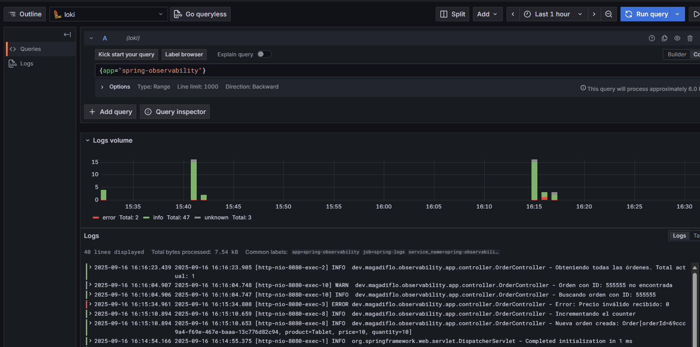

- Solo logs de `ERROR` usando el siguiente comando: `{app="spring-observability"} |= "ERROR"`.

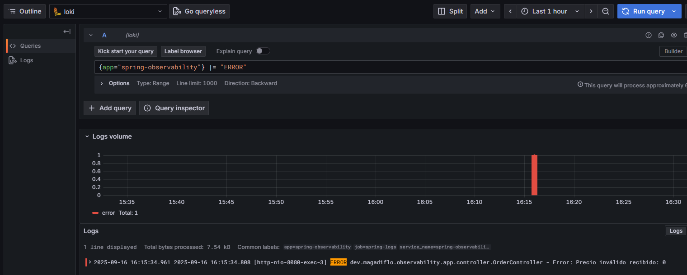

- Usando `|~` es regex match, busca logs que contengan `ERROR` o `WARN`:
  `{app="spring-observability"} |~ "(ERROR|WARN)"`

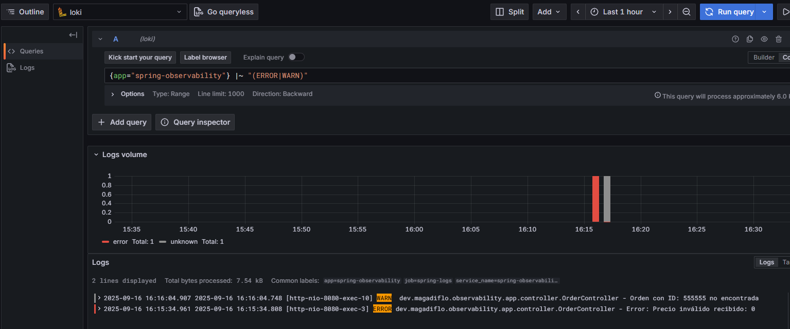

### Conclusión de la fase

En esta fase confirmamos que:

- Grafana recibe correctamente los logs de Log4j2.
- Podemos filtrarlos por palabras clave.
- Sin embargo, al no ser JSON estructurado, la potencia de consulta es más limitada.
- Esto sienta la base para la siguiente fase (2B), donde veremos Log4j2 con logs estructurados en JSON.

---

# FASE 2B: Log4j2 - Logs Estructurados (JSON)

## FASE 2B | Paso 1 - Modificar configuración a JSON

### 1. Dependencia necesaria

La siguiente dependencia `nos habilita el JsonTemplateLayout`, que es más flexible que el `JsonLayout` básico. Así
que lo agregamos a nuestro `pom.xml`:

````xml

<dependency>
    <groupId>org.apache.logging.log4j</groupId>
    <artifactId>log4j-layout-template-json</artifactId>
</dependency>
````

### 2. Caso 1 – Template por defecto (`LogstashJsonEventLayoutV1.json`)

`Log4j2` ya incluye algunos templates listos para usar, entre ellos uno compatible con `Logstash`, que es un estándar
muy usado en observabilidad, me refiero al `LogstashJsonEventLayoutV1.json`.

````xml
<?xml version="1.0" encoding="UTF-8"?>
<configuration>
    <Properties>
        <!-- Propiedad de Spring -->
        <Property name="LOG_PATH">${spring:logging.file.path:-./logs}</Property>
        <Property name="APP_NAME">${spring:spring.application.name:-app}</Property>
        <!-- Patrón común para los logs -->
        <Property name="LOG_PATTERN">%d{yyyy-MM-dd HH:mm:ss.SSS} [%t] %-5level %logger{36} - %msg%n</Property>
    </Properties>

    <Appenders>
        <!-- Appender: Consola -->
        <Console name="CONSOLE" target="SYSTEM_OUT">
            <PatternLayout pattern="${LOG_PATTERN}"/>
        </Console>

        <!-- Appender: Archivo con rotación diaria en JSON-->
        <RollingFile name="FILE"
                     fileName="${LOG_PATH}/${APP_NAME}.log"
                     filePattern="${LOG_PATH}/${APP_NAME}_%d{yyyy-MM-dd}.log">
            <JsonTemplateLayout eventTemplateUri="classpath:LogstashJsonEventLayoutV1.json"/>
            <Policies>
                <TimeBasedTriggeringPolicy interval="1" modulate="true"/>
            </Policies>
            <DefaultRolloverStrategy max="7"/>
        </RollingFile>
    </Appenders>

    <!-- Logger raíz con nivel INFO -->
    <Loggers>
        <root level="INFO">
            <AppenderRef ref="CONSOLE"/>
            <AppenderRef ref="FILE"/>
        </root>
    </Loggers>
</configuration>
````

✅ Con esta configuración, los logs salen con campos como `@timestamp`, `level`, `logger_name`, etc.

````bash
{"@version":1,"source_host":"SysEngJava","message":"Starting SpringObservabilityApplication using Java 21.0.6 with PID 15148 (D:\\programming\\spring\\15.martin_diaz\\spring-observability\\target\\classes started by magadiflo in D:\\programming\\spring\\15.martin_diaz\\spring-observability)","thread_name":"main","@timestamp":"2025-09-16T17:12:37.498-0500","level":"INFO","logger_name":"dev.magadiflo.observability.app.SpringObservabilityApplication"}
{"@version":1,"source_host":"SysEngJava","message":"Running with Spring Boot v3.5.5, Spring v6.2.10","thread_name":"main","@timestamp":"2025-09-16T17:12:37.509-0500","level":"DEBUG","logger_name":"dev.magadiflo.observability.app.SpringObservabilityApplication"}
{"@version":1,"source_host":"SysEngJava","message":"No active profile set, falling back to 1 default profile: \"default\"","thread_name":"main","@timestamp":"2025-09-16T17:12:37.511-0500","level":"INFO","logger_name":"dev.magadiflo.observability.app.SpringObservabilityApplication"}
{"@version":1,"source_host":"SysEngJava","message":"Tomcat initialized with port 8080 (http)","thread_name":"main","@timestamp":"2025-09-16T17:12:39.812-0500","level":"INFO","logger_name":"org.springframework.boot.web.embedded.tomcat.TomcatWebServer"}
{"@version":1,"source_host":"SysEngJava","message":"Initializing ProtocolHandler [\"http-nio-8080\"]","thread_name":"main","@timestamp":"2025-09-16T17:12:39.831-0500","level":"INFO","logger_name":"org.apache.coyote.http11.Http11NioProtocol"}
{"@version":1,"source_host":"SysEngJava","message":"Starting service [Tomcat]","thread_name":"main","@timestamp":"2025-09-16T17:12:39.834-0500","level":"INFO","logger_name":"org.apache.catalina.core.StandardService"}
{"@version":1,"source_host":"SysEngJava","message":"Starting Servlet engine: [Apache Tomcat/10.1.44]","thread_name":"main","@timestamp":"2025-09-16T17:12:39.835-0500","level":"INFO","logger_name":"org.apache.catalina.core.StandardEngine"}
{"@version":1,"source_host":"SysEngJava","message":"Initializing Spring embedded WebApplicationContext","thread_name":"main","@timestamp":"2025-09-16T17:12:39.950-0500","level":"INFO","logger_name":"org.apache.catalina.core.ContainerBase.[Tomcat].[localhost].[/]"}
{"@version":1,"source_host":"SysEngJava","message":"Root WebApplicationContext: initialization completed in 2381 ms","thread_name":"main","@timestamp":"2025-09-16T17:12:39.955-0500","level":"INFO","logger_name":"org.springframework.boot.web.servlet.context.ServletWebServerApplicationContext"}
{"@version":1,"source_host":"SysEngJava","message":"Exposing 3 endpoints beneath base path '/actuator'","thread_name":"main","@timestamp":"2025-09-16T17:12:41.384-0500","level":"INFO","logger_name":"org.springframework.boot.actuate.endpoint.web.EndpointLinksResolver"}
{"@version":1,"source_host":"SysEngJava","message":"Starting ProtocolHandler [\"http-nio-8080\"]","thread_name":"main","@timestamp":"2025-09-16T17:12:41.471-0500","level":"INFO","logger_name":"org.apache.coyote.http11.Http11NioProtocol"}
{"@version":1,"source_host":"SysEngJava","message":"Tomcat started on port 8080 (http) with context path '/'","thread_name":"main","@timestamp":"2025-09-16T17:12:41.518-0500","level":"INFO","logger_name":"org.springframework.boot.web.embedded.tomcat.TomcatWebServer"}
{"@version":1,"source_host":"SysEngJava","message":"Started SpringObservabilityApplication in 4.911 seconds (process running for 6.389)","thread_name":"main","@timestamp":"2025-09-16T17:12:41.541-0500","level":"INFO","logger_name":"dev.magadiflo.observability.app.SpringObservabilityApplication"}
{"@version":1,"source_host":"SysEngJava","message":"Initializing Spring DispatcherServlet 'dispatcherServlet'","thread_name":"http-nio-8080-exec-2","@timestamp":"2025-09-16T17:12:45.679-0500","level":"INFO","logger_name":"org.apache.catalina.core.ContainerBase.[Tomcat].[localhost].[/]"}
{"@version":1,"source_host":"SysEngJava","message":"Initializing Servlet 'dispatcherServlet'","thread_name":"http-nio-8080-exec-2","@timestamp":"2025-09-16T17:12:45.680-0500","level":"INFO","logger_name":"org.springframework.web.servlet.DispatcherServlet"}
{"@version":1,"source_host":"SysEngJava","message":"Completed initialization in 1 ms","thread_name":"http-nio-8080-exec-2","@timestamp":"2025-09-16T17:12:45.681-0500","level":"INFO","logger_name":"org.springframework.web.servlet.DispatcherServlet"}
````

### 2. Caso 2 – Template personalizado (`CustomLayout.json`)

Podemos crear nuestro propio template JSON para decidir exactamente qué campos incluir y cómo nombrarlos.

📄 `src/main/resources/CustomLayout.json`

````json
{
  "timestamp": {
    "$resolver": "timestamp",
    "pattern": "yyyy-MM-dd'T'HH:mm:ss.SSSZ"
  },
  "level": {
    "$resolver": "level",
    "field": "name"
  },
  "thread": {
    "$resolver": "thread",
    "field": "name"
  },
  "logger": {
    "$resolver": "logger",
    "field": "name"
  },
  "message": {
    "$resolver": "message",
    "stringified": false
  },
  "exception": {
    "$resolver": "exception",
    "field": "stackTrace",
    "stackTrace": {
      "stringified": true
    }
  }
}
````

- `"stringified": false`, estás indicando que el campo, por ejemplo el del `message`, no debe convertirse a una cadena
  de texto, sino que debe mantener su estructura original (por ejemplo, un `objeto JSON` si estás usando
  `ObjectMessage`).

📄 `log4j2-spring.xml` (apuntando al template custom):

````xml
<?xml version="1.0" encoding="UTF-8"?>
<configuration>
    <Properties>
        <!-- Propiedad de Spring -->
        <Property name="LOG_PATH">${spring:logging.file.path:-./logs}</Property>
        <Property name="APP_NAME">${spring:spring.application.name:-app}</Property>
        <!-- Patrón común para los logs -->
        <Property name="LOG_PATTERN">%d{yyyy-MM-dd HH:mm:ss.SSS} [%t] %-5level %logger{36} - %msg%n</Property>
    </Properties>

    <Appenders>
        <!-- Appender: Consola -->
        <Console name="CONSOLE" target="SYSTEM_OUT">
            <PatternLayout pattern="${LOG_PATTERN}"/>
        </Console>

        <!-- Appender: Archivo con rotación diaria en JSON-->
        <RollingFile name="FILE"
                     fileName="${LOG_PATH}/${APP_NAME}.log"
                     filePattern="${LOG_PATH}/${APP_NAME}_%d{yyyy-MM-dd}.log">
            <JsonTemplateLayout eventTemplateUri="classpath:CustomLayout.json">
                <EventTemplateAdditionalField key="service" value="${APP_NAME}"/>
            </JsonTemplateLayout>
            <Policies>
                <TimeBasedTriggeringPolicy interval="1" modulate="true"/>
            </Policies>
            <DefaultRolloverStrategy max="7"/>
        </RollingFile>
    </Appenders>

    <!-- Logger raíz con nivel INFO -->
    <Loggers>
        <root level="INFO">
            <AppenderRef ref="CONSOLE"/>
            <AppenderRef ref="FILE"/>
        </root>
    </Loggers>
</configuration>
````

- `JsonTemplateLayout`: Layout que genera JSON estructurado.
- `eventTemplateUri="classpath:CustomLayout.json"`: Usa nuestro template personalizado `CustomLayout.json`.
- `EventTemplateAdditionalField`: Agrega campo personalizado `service` con el nombre de tu `app`

✅ Con esta configuración, los logs saldrán en nuestro propio formato. Veamos una parte de logs generados.

````bash
{"timestamp":"2025-09-16T17:38:08.391-0500","level":"INFO","thread":"http-nio-8080-exec-2","logger":"org.apache.catalina.core.ContainerBase.[Tomcat].[localhost].[/]","message":"Initializing Spring DispatcherServlet 'dispatcherServlet'","service":"spring-observability"}
{"timestamp":"2025-09-16T17:38:08.391-0500","level":"INFO","thread":"http-nio-8080-exec-2","logger":"org.springframework.web.servlet.DispatcherServlet","message":"Initializing Servlet 'dispatcherServlet'","service":"spring-observability"}
{"timestamp":"2025-09-16T17:38:08.392-0500","level":"INFO","thread":"http-nio-8080-exec-2","logger":"org.springframework.web.servlet.DispatcherServlet","message":"Completed initialization in 1 ms","service":"spring-observability"}
{"timestamp":"2025-09-16T17:38:44.526-0500","level":"INFO","thread":"http-nio-8080-exec-9","logger":"dev.magadiflo.observability.app.controller.OrderController","message":"Obteniendo todas las órdenes. Total actual: 0","service":"spring-observability"}
````

📌 Con esto, en `Grafana/Loki` podrás seguir usando `| json` para filtrar por `level="ERROR"`,
`service="spring-observability"`, etc. La diferencia es que ahora tienes control absoluto sobre los campos y su formato.

## FASE 2B | Paso 2 y Paso 3

Igual que antes: `Promtail` ya configurado y `Loki` recibiendo logs.


